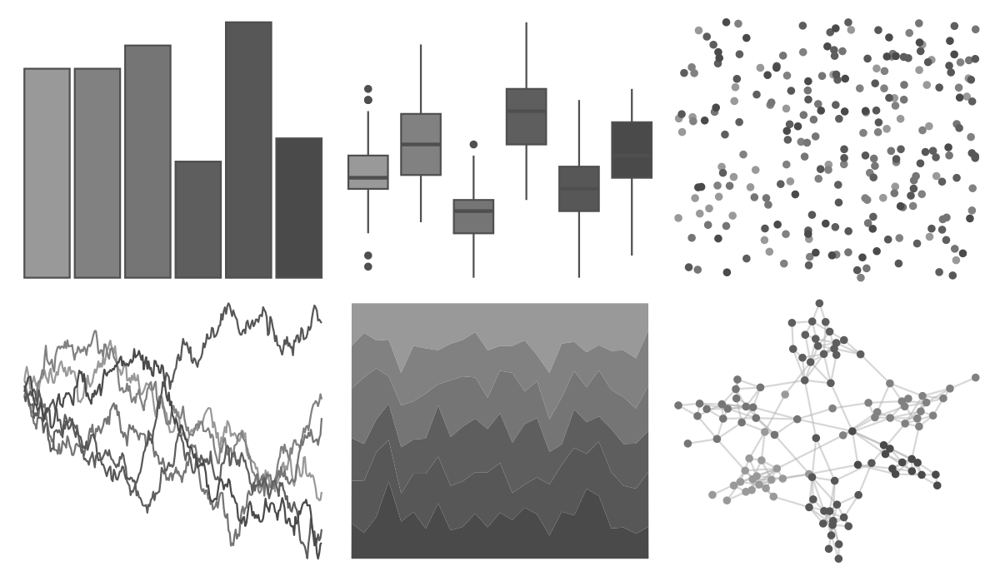

# Rdune - harkonnen2 

::: columns
::: {.column width="50%"}

**Github**

[nvietto/Rdune](https://github.com/nvietto/Rdune)
:::

::: {.column width="50%"}

**CRAN**

[Rdune](https://CRAN.R-project.org/package=Rdune)
:::
:::

<hr> 

Use with [paletteer](https://emilhvitfeldt.github.io/paletteer/) package:

```r
library(paletteer)
paletteer_d("Rdune::harkonnen2")
```

Use raw:

```r
c("#999999FF", "#818181FF", "#757575FF", "#5E5E5EFF", "#575757FF", "#4A4A4AFF")
``` 

 

<br>

# Related Palettes

<div class="list" style="display: grid; grid-template-columns: auto auto auto;"> <figure class="figure">
<a href="../../amerika/Dem_Ind_Rep3/"> </a>
</figure> <figure class="figure">
<a href="../../ButterflyColors/hemiargus_hanno/"> </a>
</figure> <figure class="figure">
<a href="../../ggprism/shades_of_gray/"> </a>
</figure> <figure class="figure">
<a href="../../ggthemes/excel_Grayscale/"> </a>
</figure> <figure class="figure">
<a href="../../ggthemes/Classic_Gray_5/"> </a>
</figure> <figure class="figure">
<a href="../../MexBrewer/Taurus2/"> </a>
</figure> <figure class="figure">
<a href="../../ggthemes/Seattle_Grays/"> </a>
</figure> <figure class="figure">
<a href="../../Rdune/corrino/"> </a>
</figure> <figure class="figure">
<a href="../../musculusColors/ErWhale/"> </a>
</figure> <figure class="figure">
<a href="../../unikn/pal_grau/"> </a>
</figure> <figure class="figure">
<a href="../../musculusColors/ErMole/"> </a>
</figure> <figure class="figure">
<a href="../../colRoz/m_oscellata/"> </a>
</figure> 
</div>
