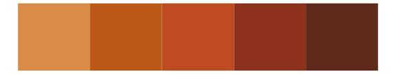

# Rdune - harkonnen4 

::: columns
::: {.column width="50%"}

**Github**

[nvietto/Rdune](https://github.com/nvietto/Rdune)
:::

::: {.column width="50%"}

**CRAN**

[Rdune](https://CRAN.R-project.org/package=Rdune)
:::
:::

<hr> 

Use with [paletteer](https://emilhvitfeldt.github.io/paletteer/) package:

```r
library(paletteer)
paletteer_d("Rdune::harkonnen4")
```

Use raw:

```r
c("#BA5D21FF", "#D2661CFF", "#DC5D08FF", "#CF5B0DFF", "#D15006FF", "#C1500BFF")
``` 

 

<br>

# Related Palettes

<div class="list" style="display: grid; grid-template-columns: auto auto auto;"> <figure class="figure">
<a href="../../amerika/Dem_Ind_Rep3/"> </a>
</figure> <figure class="figure">
<a href="../../lisa/MarkRothko/"> </a>
</figure> <figure class="figure">
<a href="../../fishualize/Sargocentron_bullisi/"> </a>
</figure> <figure class="figure">
<a href="../../fishualize/Pleuronectes_platessa/"> </a>
</figure> <figure class="figure">
<a href="../../ButterflyColors/marpesia_petreus/"> </a>
</figure> <figure class="figure">
<a href="../../fishualize/Acanthostracion_polygonius_y/"> </a>
</figure> <figure class="figure">
<a href="../../fishualize/Heretopriacanthus_cruentatus/"> </a>
</figure> <figure class="figure">
<a href="../../fishualize/Holocentrus_adscensionis/"> </a>
</figure> <figure class="figure">
<a href="../../miscpalettes/chocolate/"> </a>
</figure> <figure class="figure">
<a href="../../ggthemes/excel_Red_Orange/"> </a>
</figure> <figure class="figure">
<a href="../../fishualize/Pareiorhaphis_garbei/"> </a>
</figure> <figure class="figure">
<a href="../../fishualize/Sparisoma_tuyupiranga_f/"> </a>
</figure> 
</div>
