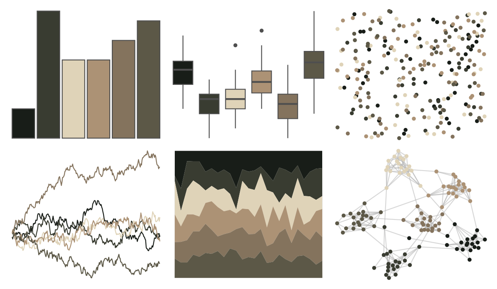

# Rdune - sandworm 

::: columns
::: {.column width="50%"}

**Github**

[nvietto/Rdune](https://github.com/nvietto/Rdune)
:::

::: {.column width="50%"}

**CRAN**

[Rdune](https://CRAN.R-project.org/package=Rdune)
:::
:::

<hr> 

Use with [paletteer](https://emilhvitfeldt.github.io/paletteer/) package:

```r
library(paletteer)
paletteer_d("Rdune::sandworm")
```

Use raw:

```r
c("#181D18FF", "#393C31FF", "#DFD3B8FF", "#AC9275FF", "#84735DFF", "#5C5847FF")
``` 

 

<br>

# Related Palettes

<div class="list" style="display: grid; grid-template-columns: auto auto auto;"> <figure class="figure">
<a href="../../amerika/Dem_Ind_Rep3/"> </a>
</figure> <figure class="figure">
<a href="../../Rdune/fermen/"> </a>
</figure> <figure class="figure">
<a href="../../wesanderson/IsleofDogs2/"> </a>
</figure> <figure class="figure">
<a href="../../tayloRswift/midnightsMahogany/"> </a>
</figure> <figure class="figure">
<a href="../../lisa/DiegoVelazquez/"> </a>
</figure> <figure class="figure">
<a href="../../poisonfrogs/Bpicturata/"> </a>
</figure> <figure class="figure">
<a href="../../Rdune/harkonnen3/"> </a>
</figure> <figure class="figure">
<a href="../../tayloRswift/midnightsJadeGreen/"> </a>
</figure> <figure class="figure">
<a href="../../trekcolors/terran/"> </a>
</figure> <figure class="figure">
<a href="../../beyonce/X103/"> </a>
</figure> <figure class="figure">
<a href="../../calecopal/creek/"> </a>
</figure> <figure class="figure">
<a href="../../colRoz/p_breviceps/"> </a>
</figure> 
</div>
