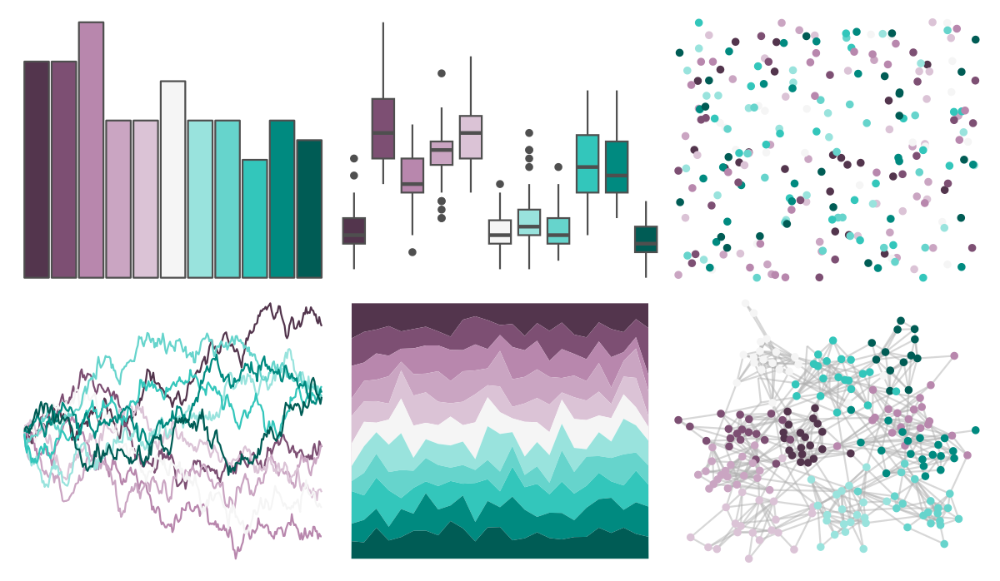

# Redmonder - dPBIPuGn 

::: columns
::: {.column width="50%"}

**Github**

Not on Github
:::

::: {.column width="50%"}

**CRAN**

[Redmonder](https://CRAN.R-project.org/package=Redmonder)
:::
:::

<hr> 

Use with [paletteer](https://emilhvitfeldt.github.io/paletteer/) package:

```r
library(paletteer)
paletteer_d("Redmonder::dPBIPuGn")
```

Use raw:

```r
c("#53354DFF", "#7D4F73FF", "#B887ADFF", "#CAA5C2FF", "#DBC3D6FF", "#F5F5F5FF", "#99E3DDFF", "#66D4CCFF", "#33C6BBFF", "#008A80FF", "#005C55FF")
``` 

 

<br>

# Related Palettes

<div class="list" style="display: grid; grid-template-columns: auto auto auto;"> <figure class="figure">
<a href="../../awtools/a_palette/"> </a>
</figure> <figure class="figure">
<a href="../../palettetown/nidoking/"> </a>
</figure> <figure class="figure">
<a href="../../beyonce/X43/"> </a>
</figure> <figure class="figure">
<a href="../../palettetown/mantine/"> </a>
</figure> <figure class="figure">
<a href="../../rcartocolor/Tropic/"> </a>
</figure> <figure class="figure">
<a href="../../palettetown/lugia/"> </a>
</figure> <figure class="figure">
<a href="../../palettetown/dragonair/"> </a>
</figure> <figure class="figure">
<a href="../../beyonce/X63/"> </a>
</figure> <figure class="figure">
<a href="../../ggthemr/lilac/"> </a>
</figure> <figure class="figure">
<a href="../../palettetown/glalie/"> </a>
</figure> <figure class="figure">
<a href="../../palettetown/nidoranm/"> </a>
</figure> <figure class="figure">
<a href="../../palettetown/aerodactyl/"> </a>
</figure> 
</div>
