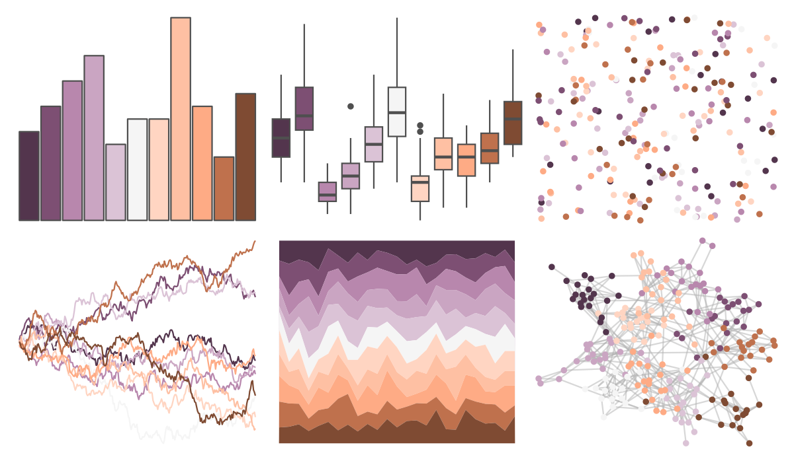

# Redmonder - dPBIPuOr 

::: columns
::: {.column width="50%"}

**Github**

Not on Github
:::

::: {.column width="50%"}

**CRAN**

[Redmonder](https://CRAN.R-project.org/package=Redmonder)
:::
:::

<hr> 

Use with [paletteer](https://emilhvitfeldt.github.io/paletteer/) package:

```r
library(paletteer)
paletteer_d("Redmonder::dPBIPuOr")
```

Use raw:

```r
c("#53354DFF", "#7D4F73FF", "#B887ADFF", "#CAA5C2FF", "#DBC3D6FF", "#F5F5F5FF", "#FFD5C2FF", "#FEC0A3FF", "#FEAB85FF", "#BF714DFF", "#7F4B33FF")
``` 

 

<br>

# Related Palettes

<div class="list" style="display: grid; grid-template-columns: auto auto auto;"> <figure class="figure">
<a href="../../awtools/a_palette/"> </a>
</figure> <figure class="figure">
<a href="../../ButterflyColors/hamadryas_feronia/"> </a>
</figure> <figure class="figure">
<a href="../../ButterflyColors/hamadryas_feronia/"> </a>
</figure> <figure class="figure">
<a href="../../palettetown/tyrogue/"> </a>
</figure> <figure class="figure">
<a href="../../palettetown/gengar/"> </a>
</figure> <figure class="figure">
<a href="../../palettetown/shellder/"> </a>
</figure> <figure class="figure">
<a href="../../palettetown/snubbull/"> </a>
</figure> <figure class="figure">
<a href="../../palettetown/seaking/"> </a>
</figure> <figure class="figure">
<a href="../../palettetown/latias/"> </a>
</figure> <figure class="figure">
<a href="../../palettetown/mr_mime/"> </a>
</figure> <figure class="figure">
<a href="../../palettetown/rattata/"> </a>
</figure> <figure class="figure">
<a href="../../palettetown/venonat/"> </a>
</figure> 
</div>
