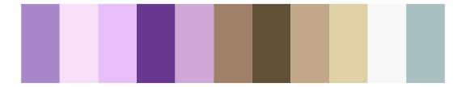

# Redmonder - dPBIRdBu 

::: columns
::: {.column width="50%"}

**Github**

Not on Github
:::

::: {.column width="50%"}

**CRAN**

[Redmonder](https://CRAN.R-project.org/package=Redmonder)
:::
:::

<hr> 

Use with [paletteer](https://emilhvitfeldt.github.io/paletteer/) package:

```r
library(paletteer)
paletteer_d("Redmonder::dPBIRdBu")
```

Use raw:

```r
c("#7F312FFF", "#BE4A47FF", "#FD817EFF", "#FEA19EFF", "#FEC0BFFF", "#F5F5F5FF", "#D0EEF7FF", "#B9E5F3FF", "#A1DDEFFF", "#689FB0FF", "#456A76FF")
``` 

 

<br>

# Related Palettes

<div class="list" style="display: grid; grid-template-columns: auto auto auto;"> <figure class="figure">
<a href="../../awtools/a_palette/"> </a>
</figure> <figure class="figure">
<a href="../../khroma/BuRd/"> </a>
</figure> <figure class="figure">
<a href="../../palettetown/nidorina/"> </a>
</figure> <figure class="figure">
<a href="../../palettetown/pupitar/"> </a>
</figure> <figure class="figure">
<a href="../../palettetown/phanpy/"> </a>
</figure> <figure class="figure">
<a href="../../palettetown/nidoranf/"> </a>
</figure> <figure class="figure">
<a href="../../palettetown/tangela/"> </a>
</figure> <figure class="figure">
<a href="../../palettetown/latios/"> </a>
</figure> <figure class="figure">
<a href="../../palettetown/metagross/"> </a>
</figure> <figure class="figure">
<a href="../../palettetown/metang/"> </a>
</figure> <figure class="figure">
<a href="../../unikn/pal_unikn_pair/"> </a>
</figure> <figure class="figure">
<a href="../../palettetown/venomoth/"> </a>
</figure> 
</div>
