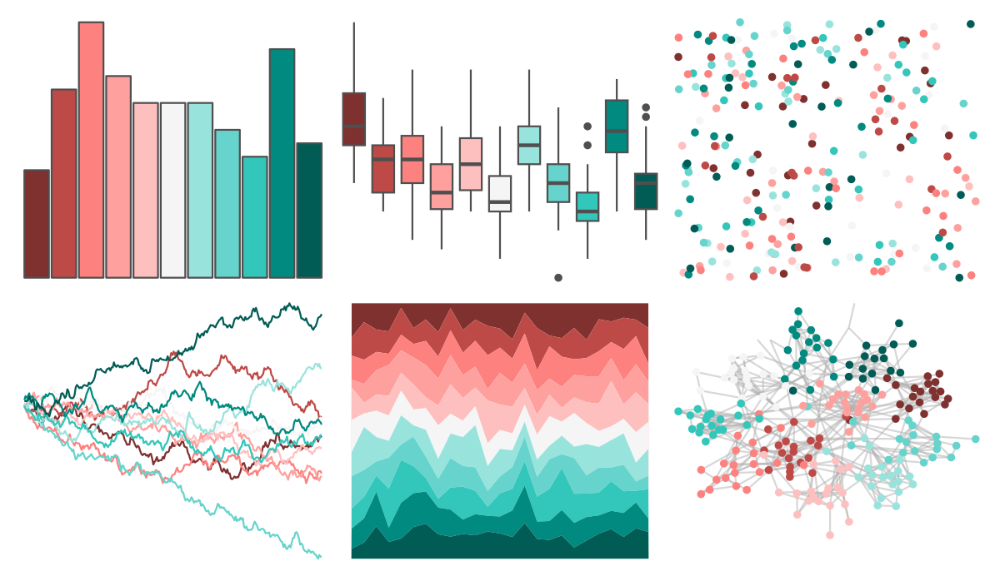

# Redmonder - dPBIRdGn 

::: columns
::: {.column width="50%"}

**Github**

Not on Github
:::

::: {.column width="50%"}

**CRAN**

[Redmonder](https://CRAN.R-project.org/package=Redmonder)
:::
:::

<hr> 

Use with [paletteer](https://emilhvitfeldt.github.io/paletteer/) package:

```r
library(paletteer)
paletteer_d("Redmonder::dPBIRdGn")
```

Use raw:

```r
c("#7F312FFF", "#BE4A47FF", "#FD817EFF", "#FEA19EFF", "#FEC0BFFF", "#F5F5F5FF", "#99E3DDFF", "#66D4CCFF", "#33C6BBFF", "#008A80FF", "#005C55FF")
``` 

 

<br>

# Related Palettes

<div class="list" style="display: grid; grid-template-columns: auto auto auto;"> <figure class="figure">
<a href="../../awtools/a_palette/"> </a>
</figure> <figure class="figure">
<a href="../../ButterflyColors/hamadryas_feronia/"> </a>
</figure> <figure class="figure">
<a href="../../ButterflyColors/hamadryas_feronia/"> </a>
</figure> <figure class="figure">
<a href="../../RColorBrewer/BrBG/"> </a>
</figure> <figure class="figure">
<a href="../../beyonce/X129/"> </a>
</figure> <figure class="figure">
<a href="../../RColorBrewer/RdBu/"> </a>
</figure> <figure class="figure">
<a href="../../palettetown/surskit/"> </a>
</figure> <figure class="figure">
<a href="../../colorBlindness/Brown2Blue10Steps/"> </a>
</figure> <figure class="figure">
<a href="../../palettetown/tentacool/"> </a>
</figure> <figure class="figure">
<a href="../../dichromat/BrowntoBlue_10/"> </a>
</figure> <figure class="figure">
<a href="../../ggthemr/carrot/"> </a>
</figure> <figure class="figure">
<a href="../../rcartocolor/TealRose/"> </a>
</figure> 
</div>
