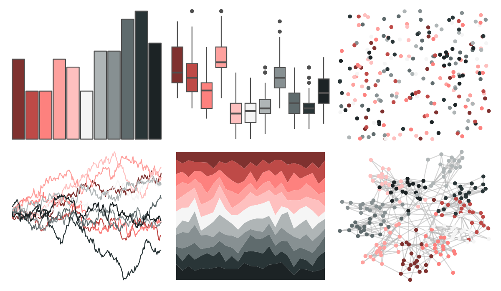

# Redmonder - dPBIRdGy 

::: columns
::: {.column width="50%"}

**Github**

Not on Github
:::

::: {.column width="50%"}

**CRAN**

[Redmonder](https://CRAN.R-project.org/package=Redmonder)
:::
:::

<hr> 

Use with [paletteer](https://emilhvitfeldt.github.io/paletteer/) package:

```r
library(paletteer)
paletteer_d("Redmonder::dPBIRdGy")
```

Use raw:

```r
c("#7F312FFF", "#BE4A47FF", "#FD817EFF", "#FEA19EFF", "#FEC0BFFF", "#F5F5F5FF", "#AFB5B6FF", "#879092FF", "#5F6B6DFF", "#293537FF", "#1C2325FF")
``` 

 

<br>

# Related Palettes

<div class="list" style="display: grid; grid-template-columns: auto auto auto;"> <figure class="figure">
<a href="../../awtools/a_palette/"> </a>
</figure> <figure class="figure">
<a href="../../palettetown/venonat/"> </a>
</figure> <figure class="figure">
<a href="../../futurevisions/kepler186/"> </a>
</figure> <figure class="figure">
<a href="../../palettetown/zangoose/"> </a>
</figure> <figure class="figure">
<a href="../../palettetown/mr_mime/"> </a>
</figure> <figure class="figure">
<a href="../../palettetown/haunter/"> </a>
</figure> <figure class="figure">
<a href="../../palettetown/granbull/"> </a>
</figure> <figure class="figure">
<a href="../../palettetown/corsola/"> </a>
</figure> <figure class="figure">
<a href="../../palettetown/absol/"> </a>
</figure> <figure class="figure">
<a href="../../palettetown/rhyhorn/"> </a>
</figure> <figure class="figure">
<a href="../../palettetown/gengar/"> </a>
</figure> <figure class="figure">
<a href="../../trekcolors/lcars_red_alert/"> </a>
</figure> 
</div>
