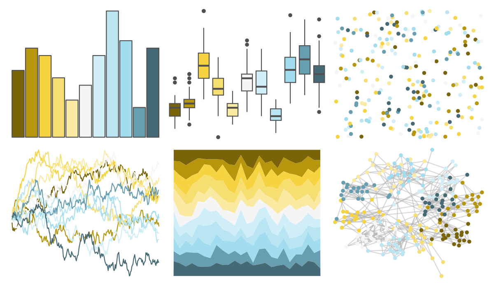

# Redmonder - dPBIYlBu 

::: columns
::: {.column width="50%"}

**Github**

[pmdci/redmonder](https://github.com/pmdci/redmonder)
:::

::: {.column width="50%"}

**CRAN**

[Redmonder](https://CRAN.R-project.org/package=Redmonder)
:::
:::

<hr> 

Use with [paletteer](https://emilhvitfeldt.github.io/paletteer/) package:

```r
library(paletteer)
paletteer_d("Redmonder::dPBIYlBu")
```

Use raw:

```r
c("#796409FF", "#B6960DFF", "#F5D341FF", "#F7DE70FF", "#FAE9A0FF", "#F5F5F5FF", "#D0EEF7FF", "#B9E5F3FF", "#A1DDEFFF", "#689FB0FF", "#456A76FF")
``` 

 

<br>

# Related Palettes

<div class="list" style="display: grid; grid-template-columns: auto auto auto;"> <figure class="figure">
<a href="../../amerika/Dem_Ind_Rep3/"> </a>
</figure> <figure class="figure">
<a href="../../palettetown/hitmontop/"> </a>
</figure> <figure class="figure">
<a href="../../palettetown/dunsparce/"> </a>
</figure> <figure class="figure">
<a href="../../ggprism/ocean2/"> </a>
</figure> <figure class="figure">
<a href="../../ggprism/ocean3/"> </a>
</figure> <figure class="figure">
<a href="../../palettetown/teddiursa/"> </a>
</figure> <figure class="figure">
<a href="../../palettetown/dragonite/"> </a>
</figure> <figure class="figure">
<a href="../../palettetown/omanyte/"> </a>
</figure> <figure class="figure">
<a href="../../palettetown/celebi/"> </a>
</figure> <figure class="figure">
<a href="../../palettetown/hypno/"> </a>
</figure> <figure class="figure">
<a href="../../Redmonder/dPBIYlPu/"> </a>
</figure> <figure class="figure">
<a href="../../peRReo/rosalia/"> </a>
</figure> 
</div>
