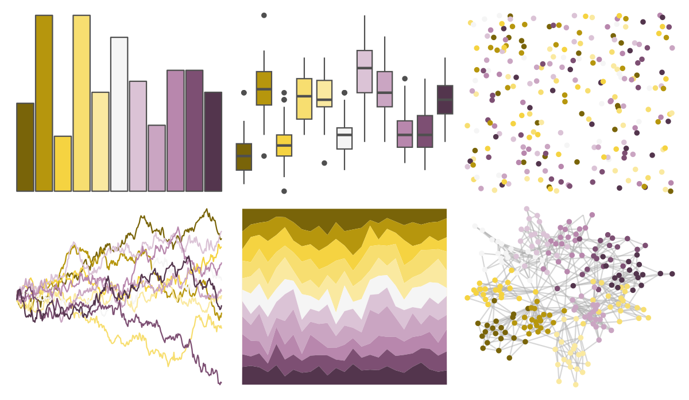

# Redmonder - dPBIYlPu 

::: columns
::: {.column width="50%"}

**Github**

Not on Github
:::

::: {.column width="50%"}

**CRAN**

[Redmonder](https://CRAN.R-project.org/package=Redmonder)
:::
:::

<hr> 

Use with [paletteer](https://emilhvitfeldt.github.io/paletteer/) package:

```r
library(paletteer)
paletteer_d("Redmonder::dPBIYlPu")
```

Use raw:

```r
c("#796409FF", "#B6960DFF", "#F5D341FF", "#F7DE70FF", "#FAE9A0FF", "#F5F5F5FF", "#DBC3D6FF", "#CAA5C2FF", "#B887ADFF", "#7D4F73FF", "#53354DFF")
``` 

 

<br>

# Related Palettes

<div class="list" style="display: grid; grid-template-columns: auto auto auto;"> <figure class="figure">
<a href="../../awtools/a_palette/"> </a>
</figure> <figure class="figure">
<a href="../../ButterflyColors/hamadryas_feronia/"> </a>
</figure> <figure class="figure">
<a href="../../ButterflyColors/hamadryas_feronia/"> </a>
</figure> <figure class="figure">
<a href="../../palettetown/tauros/"> </a>
</figure> <figure class="figure">
<a href="../../palettetown/jolteon/"> </a>
</figure> <figure class="figure">
<a href="../../palettetown/heracross/"> </a>
</figure> <figure class="figure">
<a href="../../palettetown/elekid/"> </a>
</figure> <figure class="figure">
<a href="../../palettetown/hitmontop/"> </a>
</figure> <figure class="figure">
<a href="../../palettetown/snorlax/"> </a>
</figure> <figure class="figure">
<a href="../../palettetown/kangaskhan/"> </a>
</figure> <figure class="figure">
<a href="../../palettetown/weezing/"> </a>
</figure> <figure class="figure">
<a href="../../palettetown/hitmonlee/"> </a>
</figure> 
</div>
