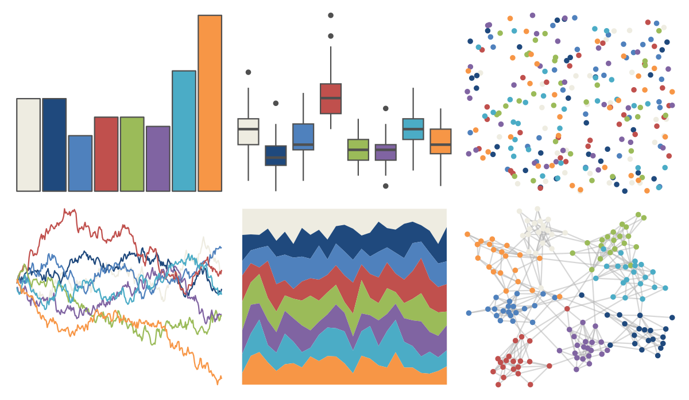

# Redmonder - qMSO12 

::: columns
::: {.column width="50%"}

**Github**

Not on Github
:::

::: {.column width="50%"}

**CRAN**

[Redmonder](https://CRAN.R-project.org/package=Redmonder)
:::
:::

<hr> 

Use with [paletteer](https://emilhvitfeldt.github.io/paletteer/) package:

```r
library(paletteer)
paletteer_d("Redmonder::qMSO12")
```

Use raw:

```r
c("#EEECE1FF", "#1F497DFF", "#4F81BDFF", "#C0504DFF", "#9BBB59FF", "#8064A2FF", "#4BACC6FF", "#F79646FF")
``` 

 

<br>

# Related Palettes

<div class="list" style="display: grid; grid-template-columns: auto auto auto;"> <figure class="figure">
<a href="../../awtools/a_palette/"> </a>
</figure> <figure class="figure">
<a href="../../Redmonder/qMSO15/"> </a>
</figure> <figure class="figure">
<a href="../../peRReo/calle13/"> </a>
</figure> <figure class="figure">
<a href="../../tidyquant/tq_light/"> </a>
</figure> <figure class="figure">
<a href="../../futurevisions/kepler16b/"> </a>
</figure> <figure class="figure">
<a href="../../ggthemes/excel_Office_2007_2010/"> </a>
</figure> <figure class="figure">
<a href="../../ggsci/default_nejm/"> </a>
</figure> <figure class="figure">
<a href="../../ggthemr/flat_dark/"> </a>
</figure> <figure class="figure">
<a href="../../Redmonder/qPBI/"> </a>
</figure> <figure class="figure">
<a href="../../RColorBrewer/Accent/"> </a>
</figure> <figure class="figure">
<a href="../../nationalparkcolors/BlueRidgePkwy/"> </a>
</figure> <figure class="figure">
<a href="../../ggthemes/Tableau_10/"> </a>
</figure> 
</div>
