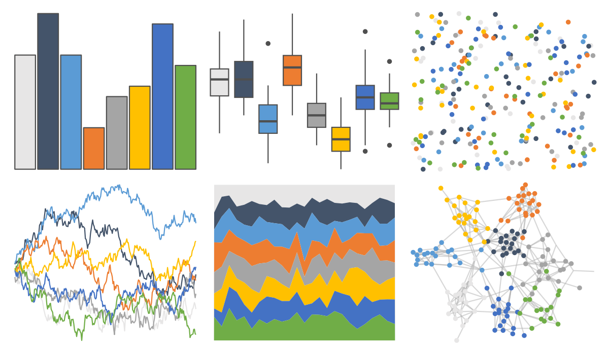

# Redmonder - qMSO15 

::: columns
::: {.column width="50%"}

**Github**

[pmdci/redmonder](https://github.com/pmdci/redmonder)
:::

::: {.column width="50%"}

**CRAN**

[Redmonder](https://CRAN.R-project.org/package=Redmonder)
:::
:::

<hr> 

Use with [paletteer](https://emilhvitfeldt.github.io/paletteer/) package:

```r
library(paletteer)
paletteer_d("Redmonder::qMSO15")
```

Use raw:

```r
c("#E7E6E6FF", "#44546AFF", "#5B9BD5FF", "#ED7D31FF", "#A5A5A5FF", "#FFC000FF", "#4472C4FF", "#70AD47FF")
``` 

 

<br>

# Related Palettes

<div class="list" style="display: grid; grid-template-columns: auto auto auto;"> <figure class="figure">
<a href="../../amerika/Dem_Ind_Rep3/"> </a>
</figure> <figure class="figure">
<a href="../../ggthemr/earth/"> </a>
</figure> <figure class="figure">
<a href="../../Redmonder/qMSO12/"> </a>
</figure> <figure class="figure">
<a href="../../ggsci/light_uchicago/"> </a>
</figure> <figure class="figure">
<a href="../../IslamicArt/jerusalem/"> </a>
</figure> <figure class="figure">
<a href="../../Redmonder/qMSOMrq/"> </a>
</figure> <figure class="figure">
<a href="../../palettetown/seel/"> </a>
</figure> <figure class="figure">
<a href="../../ggthemes/Miller_Stone/"> </a>
</figure> <figure class="figure">
<a href="../../werpals/jozi/"> </a>
</figure> <figure class="figure">
<a href="../../ggthemes/Tableau_10/"> </a>
</figure> <figure class="figure">
<a href="../../awtools/mpalette/"> </a>
</figure> <figure class="figure">
<a href="../../NatParksPalettes/Yellowstone/"> </a>
</figure> 
</div>
