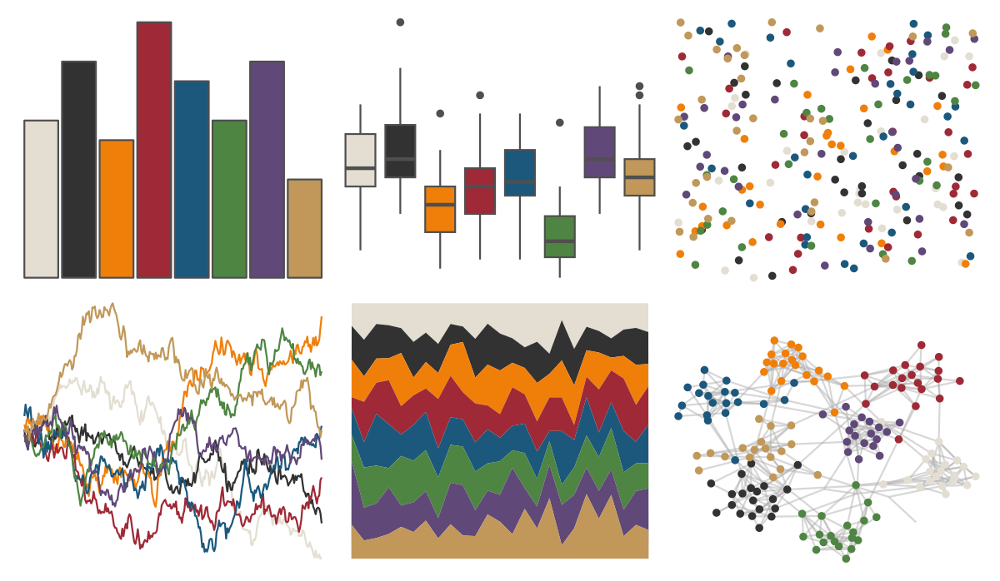
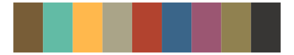

# Redmonder - qMSOAsp 

::: columns
::: {.column width="50%"}

**Github**

Not on Github
:::

::: {.column width="50%"}

**CRAN**

[Redmonder](https://CRAN.R-project.org/package=Redmonder)
:::
:::

<hr> 

Use with [paletteer](https://emilhvitfeldt.github.io/paletteer/) package:

```r
library(paletteer)
paletteer_d("Redmonder::qMSOAsp")
```

Use raw:

```r
c("#E3DED1FF", "#323232FF", "#F07F09FF", "#9F2936FF", "#1B587CFF", "#4E8542FF", "#604878FF", "#C19859FF")
``` 

 

<br>

# Related Palettes

<div class="list" style="display: grid; grid-template-columns: auto auto auto;"> <figure class="figure">
<a href="../../awtools/a_palette/"> </a>
</figure> <figure class="figure">
<a href="../../ButterflyColors/hamadryas_feronia/"> </a>
</figure> <figure class="figure">
<a href="../../ButterflyColors/hamadryas_feronia/"> </a>
</figure> <figure class="figure">
<a href="../../PrettyCols/TangerineBlues/"> </a>
</figure> <figure class="figure">
<a href="../../NatParksPalettes/Triglav/"> </a>
</figure> <figure class="figure">
<a href="../../ggthemr/light/"> </a>
</figure> <figure class="figure">
<a href="../../IslamicArt/alhambra/"> </a>
</figure> <figure class="figure">
<a href="../../miscpalettes/dreaming/"> </a>
</figure> <figure class="figure">
<a href="../../nationalparkcolors/GeneralGrant/"> </a>
</figure> <figure class="figure">
<a href="../../MetBrewer/Demuth/"> </a>
</figure> <figure class="figure">
<a href="../../ggthemr/pale/"> </a>
</figure> <figure class="figure">
<a href="../../Redmonder/qMSO12/"> </a>
</figure> 
</div>
