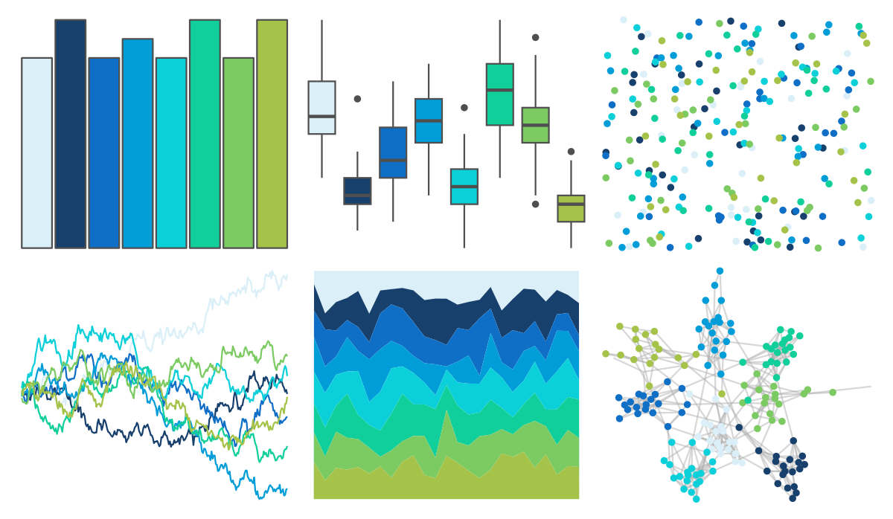
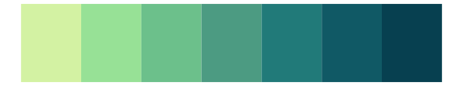

# Redmonder - qMSOBu 

::: columns
::: {.column width="50%"}

**Github**

Not on Github
:::

::: {.column width="50%"}

**CRAN**

[Redmonder](https://CRAN.R-project.org/package=Redmonder)
:::
:::

<hr> 

Use with [paletteer](https://emilhvitfeldt.github.io/paletteer/) package:

```r
library(paletteer)
paletteer_d("Redmonder::qMSOBu")
```

Use raw:

```r
c("#DBEFF9FF", "#17406DFF", "#0F6FC6FF", "#009DD9FF", "#0BD0D9FF", "#10CF9BFF", "#7CCA62FF", "#A5C249FF")
``` 

 

<br>

# Related Palettes

<div class="list" style="display: grid; grid-template-columns: auto auto auto;"> <figure class="figure">
<a href="../../awtools/a_palette/"> </a>
</figure> <figure class="figure">
<a href="../../rcartocolor/BluYl/"> </a>
</figure> <figure class="figure">
<a href="../../werpals/lakelouise/"> </a>
</figure> <figure class="figure">
<a href="../../RColorBrewer/GnBu/"> </a>
</figure> <figure class="figure">
<a href="../../rcartocolor/Emrld/"> </a>
</figure> <figure class="figure">
<a href="../../RColorBrewer/YlGnBu/"> </a>
</figure> <figure class="figure">
<a href="../../LaCroixColoR/Lime/"> </a>
</figure> <figure class="figure">
<a href="../../MetBrewer/Hokusai3/"> </a>
</figure> <figure class="figure">
<a href="../../fishualize/Chlorurus_spilurus/"> </a>
</figure> <figure class="figure">
<a href="../../ggthemes/excel_Blue/"> </a>
</figure> <figure class="figure">
<a href="../../NatParksPalettes/Denali/"> </a>
</figure> <figure class="figure">
<a href="../../rcartocolor/DarkMint/"> </a>
</figure> 
</div>
