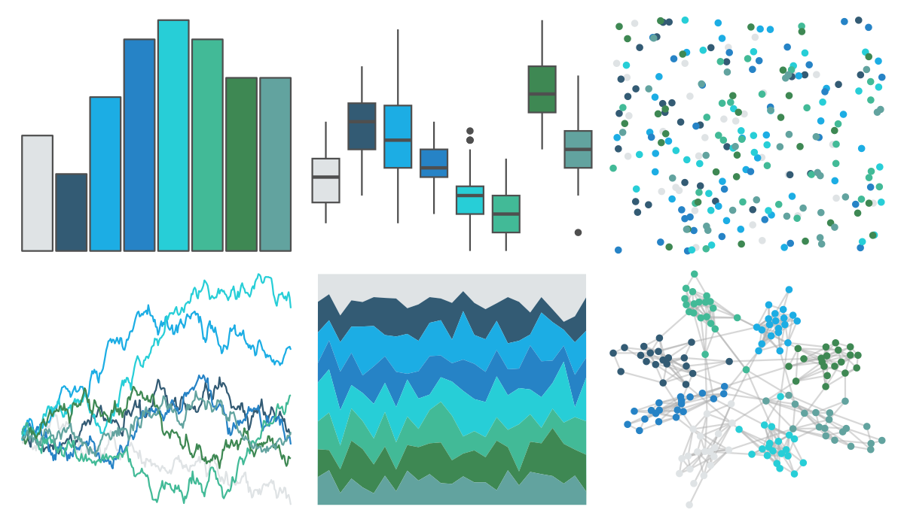

# Redmonder - qMSOBu2 

::: columns
::: {.column width="50%"}

**Github**

Not on Github
:::

::: {.column width="50%"}

**CRAN**

[Redmonder](https://CRAN.R-project.org/package=Redmonder)
:::
:::

<hr> 

Use with [paletteer](https://emilhvitfeldt.github.io/paletteer/) package:

```r
library(paletteer)
paletteer_d("Redmonder::qMSOBu2")
```

Use raw:

```r
c("#DFE3E5FF", "#335B74FF", "#1CADE4FF", "#2683C6FF", "#27CED7FF", "#42BA97FF", "#3E8853FF", "#62A39FFF")
``` 

 

<br>

# Related Palettes

<div class="list" style="display: grid; grid-template-columns: auto auto auto;"> <figure class="figure">
<a href="../../awtools/a_palette/"> </a>
</figure> <figure class="figure">
<a href="../../rcartocolor/DarkMint/"> </a>
</figure> <figure class="figure">
<a href="../../musculusColors/Bmlunge/"> </a>
</figure> <figure class="figure">
<a href="../../miscpalettes/seaGreen/"> </a>
</figure> <figure class="figure">
<a href="../../rcartocolor/Mint/"> </a>
</figure> <figure class="figure">
<a href="../../palettetown/pineco/"> </a>
</figure> <figure class="figure">
<a href="../../palettetown/wobbuffet/"> </a>
</figure> <figure class="figure">
<a href="../../rcartocolor/Teal/"> </a>
</figure> <figure class="figure">
<a href="../../NatParksPalettes/Banff/"> </a>
</figure> <figure class="figure">
<a href="../../rcartocolor/BluGrn/"> </a>
</figure> <figure class="figure">
<a href="../../Redmonder/qMSOBuGn/"> </a>
</figure> <figure class="figure">
<a href="../../trekcolors/romulan2/"> </a>
</figure> 
</div>
