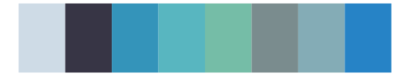
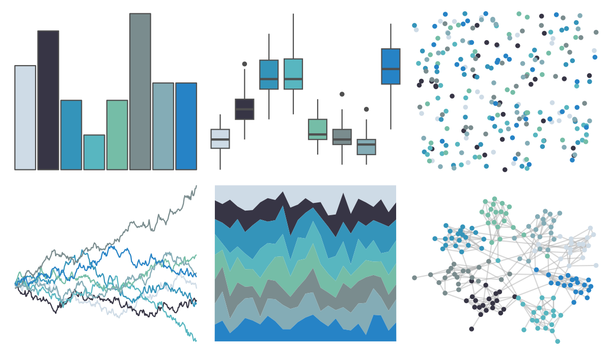

# Redmonder - qMSOBuGn 

::: columns
::: {.column width="50%"}

**Github**

[pmdci/redmonder](https://github.com/pmdci/redmonder)
:::

::: {.column width="50%"}

**CRAN**

[Redmonder](https://CRAN.R-project.org/package=Redmonder)
:::
:::

<hr> 

Use with [paletteer](https://emilhvitfeldt.github.io/paletteer/) package:

```r
library(paletteer)
paletteer_d("Redmonder::qMSOBuGn")
```

Use raw:

```r
c("#CEDBE6FF", "#373545FF", "#3494BAFF", "#58B6C0FF", "#75BDA7FF", "#7A8C8EFF", "#84ACB6FF", "#2683C6FF")
``` 

 

<br>

# Related Palettes

<div class="list" style="display: grid; grid-template-columns: auto auto auto;"> <figure class="figure">
<a href="../../amerika/Dem_Ind_Rep3/"> </a>
</figure> <figure class="figure">
<a href="../../palettetown/wobbuffet/"> </a>
</figure> <figure class="figure">
<a href="../../palettetown/remoraid/"> </a>
</figure> <figure class="figure">
<a href="../../Redmonder/qMSOPu/"> </a>
</figure> <figure class="figure">
<a href="../../Manu/Korora/"> </a>
</figure> <figure class="figure">
<a href="../../Redmonder/qMSOBu2/"> </a>
</figure> <figure class="figure">
<a href="../../beyonce/X101/"> </a>
</figure> <figure class="figure">
<a href="../../nord/baie_mouton/"> </a>
</figure> <figure class="figure">
<a href="../../Redmonder/dPBIPuGn/"> </a>
</figure> <figure class="figure">
<a href="../../ochRe/dead_reef/"> </a>
</figure> <figure class="figure">
<a href="../../fishualize/Opisthonema_oglinum/"> </a>
</figure> <figure class="figure">
<a href="../../nord/afternoon_prarie/"> </a>
</figure> 
</div>
