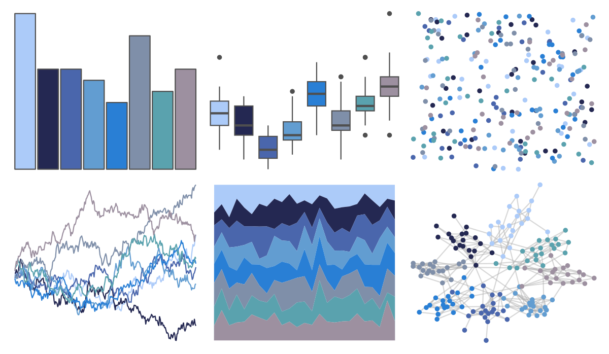

# Redmonder - qMSOBuWarm 

::: columns
::: {.column width="50%"}

**Github**

[pmdci/redmonder](https://github.com/pmdci/redmonder)
:::

::: {.column width="50%"}

**CRAN**

[Redmonder](https://CRAN.R-project.org/package=Redmonder)
:::
:::

<hr> 

Use with [paletteer](https://emilhvitfeldt.github.io/paletteer/) package:

```r
library(paletteer)
paletteer_d("Redmonder::qMSOBuWarm")
```

Use raw:

```r
c("#ACCBF9FF", "#242852FF", "#4A66ACFF", "#629DD1FF", "#297FD5FF", "#7F8FA9FF", "#5AA2AEFF", "#9D90A0FF")
``` 

 

<br>

# Related Palettes

<div class="list" style="display: grid; grid-template-columns: auto auto auto;"> <figure class="figure">
<a href="../../amerika/Dem_Ind_Rep3/"> </a>
</figure> <figure class="figure">
<a href="../../palettetown/quagsire/"> </a>
</figure> <figure class="figure">
<a href="../../palettetown/dragonair/"> </a>
</figure> <figure class="figure">
<a href="../../severance/Dinner/"> </a>
</figure> <figure class="figure">
<a href="../../MetBrewer/Hokusai2/"> </a>
</figure> <figure class="figure">
<a href="../../Manu/Korora/"> </a>
</figure> <figure class="figure">
<a href="../../palettetown/lugia/"> </a>
</figure> <figure class="figure">
<a href="../../palettetown/wobbuffet/"> </a>
</figure> <figure class="figure">
<a href="../../miscpalettes/waterfall/"> </a>
</figure> <figure class="figure">
<a href="../../tvthemes/WaterTribe/"> </a>
</figure> <figure class="figure">
<a href="../../palettetown/beldum/"> </a>
</figure> <figure class="figure">
<a href="../../palettetown/gligar/"> </a>
</figure> 
</div>
