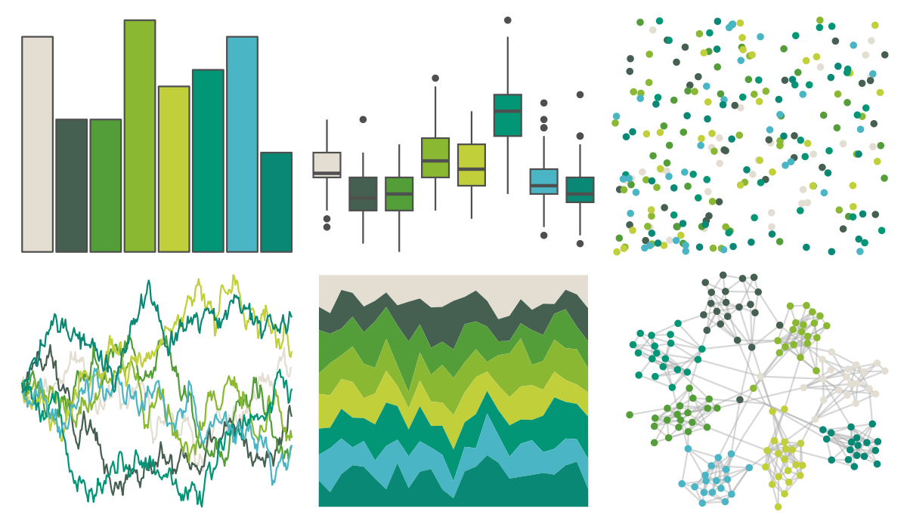

# Redmonder - qMSOGn 

::: columns
::: {.column width="50%"}

**Github**

Not on Github
:::

::: {.column width="50%"}

**CRAN**

[Redmonder](https://CRAN.R-project.org/package=Redmonder)
:::
:::

<hr> 

Use with [paletteer](https://emilhvitfeldt.github.io/paletteer/) package:

```r
library(paletteer)
paletteer_d("Redmonder::qMSOGn")
```

Use raw:

```r
c("#E3DED1FF", "#455F51FF", "#549E39FF", "#8AB833FF", "#C0CF3AFF", "#029676FF", "#4AB5C4FF", "#098975FF")
``` 

 

<br>

# Related Palettes

<div class="list" style="display: grid; grid-template-columns: auto auto auto;"> <figure class="figure">
<a href="../../awtools/a_palette/"> </a>
</figure> <figure class="figure">
<a href="../../ButterflyColors/hamadryas_feronia/"> </a>
</figure> <figure class="figure">
<a href="../../ButterflyColors/hamadryas_feronia/"> </a>
</figure> <figure class="figure">
<a href="../../Redmonder/qMSOGnYl/"> </a>
</figure> <figure class="figure">
<a href="../../Redmonder/sPBIYlGn/"> </a>
</figure> <figure class="figure">
<a href="../../palettetown/omastar/"> </a>
</figure> <figure class="figure">
<a href="../../ggprism/quiet2/"> </a>
</figure> <figure class="figure">
<a href="../../nationalparkcolors/Voyageurs/"> </a>
</figure> <figure class="figure">
<a href="../../palettetown/omanyte/"> </a>
</figure> <figure class="figure">
<a href="../../fishualize/Gadus_morhua/"> </a>
</figure> <figure class="figure">
<a href="../../ggthemes/excel_Green/"> </a>
</figure> <figure class="figure">
<a href="../../nationalparkcolors/Yellowstone/"> </a>
</figure> 
</div>
