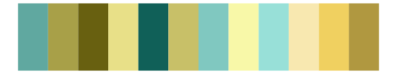

# Redmonder - qMSOGnYl 

::: columns
::: {.column width="50%"}

**Github**

Not on Github
:::

::: {.column width="50%"}

**CRAN**

[Redmonder](https://CRAN.R-project.org/package=Redmonder)
:::
:::

<hr> 

Use with [paletteer](https://emilhvitfeldt.github.io/paletteer/) package:

```r
library(paletteer)
paletteer_d("Redmonder::qMSOGnYl")
```

Use raw:

```r
c("#E2DFCCFF", "#455F51FF", "#99CB38FF", "#63A537FF", "#37A76FFF", "#44C1A3FF", "#4EB3CFFF", "#51C3F9FF")
``` 

 

<br>

# Related Palettes

<div class="list" style="display: grid; grid-template-columns: auto auto auto;"> <figure class="figure">
<a href="../../awtools/a_palette/"> </a>
</figure> <figure class="figure">
<a href="../../Redmonder/qMSOGn/"> </a>
</figure> <figure class="figure">
<a href="../../Redmonder/sPBIYlGn/"> </a>
</figure> <figure class="figure">
<a href="../../nationalparkcolors/Voyageurs/"> </a>
</figure> <figure class="figure">
<a href="../../ggthemes/excel_Green_Yellow/"> </a>
</figure> <figure class="figure">
<a href="../../fishualize/Gadus_morhua/"> </a>
</figure> <figure class="figure">
<a href="../../ggthemes/excel_Green/"> </a>
</figure> <figure class="figure">
<a href="../../fishualize/Parablennius_pilicornis/"> </a>
</figure> <figure class="figure">
<a href="../../RColorBrewer/BuGn/"> </a>
</figure> <figure class="figure">
<a href="../../palettetown/celebi/"> </a>
</figure> <figure class="figure">
<a href="../../RColorBrewer/Greens/"> </a>
</figure> <figure class="figure">
<a href="../../palettetown/omastar/"> </a>
</figure> 
</div>
