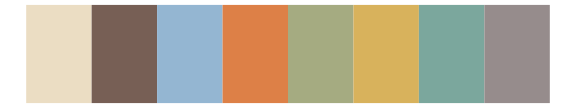
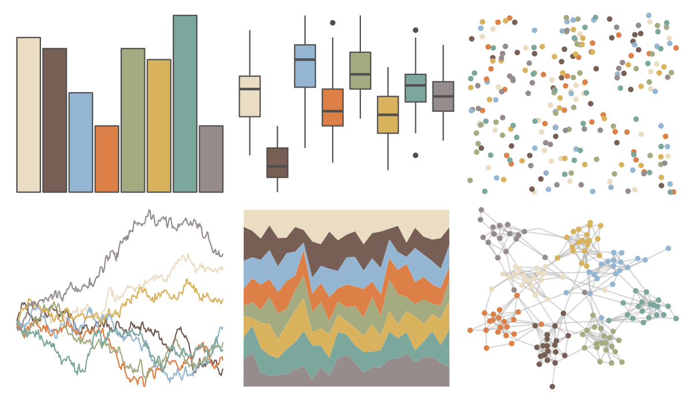

# Redmonder - qMSOMed 

::: columns
::: {.column width="50%"}

**Github**

Not on Github
:::

::: {.column width="50%"}

**CRAN**

[Redmonder](https://CRAN.R-project.org/package=Redmonder)
:::
:::

<hr> 

Use with [paletteer](https://emilhvitfeldt.github.io/paletteer/) package:

```r
library(paletteer)
paletteer_d("Redmonder::qMSOMed")
```

Use raw:

```r
c("#EBDDC3FF", "#775F55FF", "#94B6D2FF", "#DD8047FF", "#A5AB81FF", "#D8B25CFF", "#7BA79DFF", "#968C8CFF")
``` 

 

<br>

# Related Palettes

<div class="list" style="display: grid; grid-template-columns: auto auto auto;"> <figure class="figure">
<a href="../../awtools/a_palette/"> </a>
</figure> <figure class="figure">
<a href="../../ggthemes/excel_Median/"> </a>
</figure> <figure class="figure">
<a href="../../yarrr/decision/"> </a>
</figure> <figure class="figure">
<a href="../../Redmonder/qMSOOr/"> </a>
</figure> <figure class="figure">
<a href="../../calecopal/chaparral1/"> </a>
</figure> <figure class="figure">
<a href="../../lisa/J_M_W_Turner/"> </a>
</figure> <figure class="figure">
<a href="../../nationalparkcolors/BryceCanyon/"> </a>
</figure> <figure class="figure">
<a href="../../lisa/JeffKoons/"> </a>
</figure> <figure class="figure">
<a href="../../ggthemes/excel_Crop/"> </a>
</figure> <figure class="figure">
<a href="../../calecopal/arbutus/"> </a>
</figure> <figure class="figure">
<a href="../../rcartocolor/Earth/"> </a>
</figure> <figure class="figure">
<a href="../../dutchmasters/view_of_Delft/"> </a>
</figure> 
</div>
