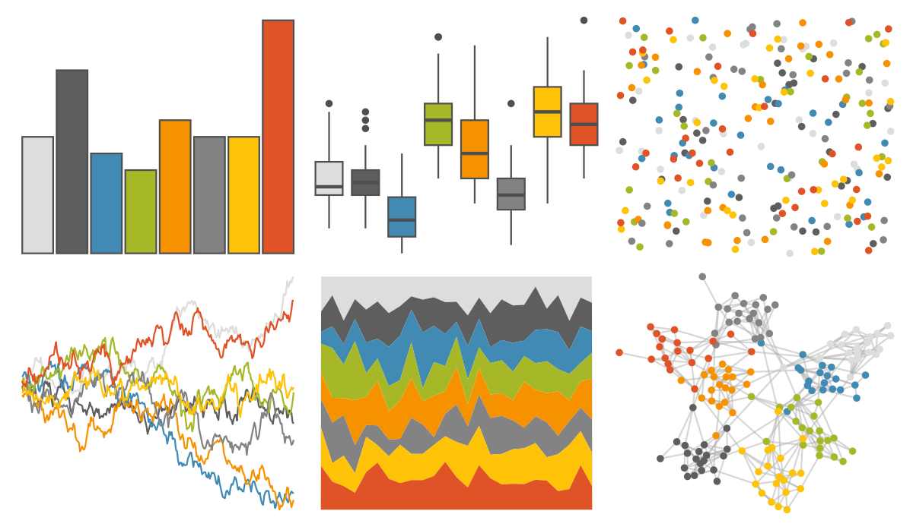
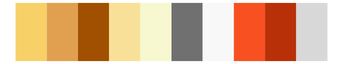

# Redmonder - qMSOMrq 

::: columns
::: {.column width="50%"}

**Github**

[pmdci/redmonder](https://github.com/pmdci/redmonder)
:::

::: {.column width="50%"}

**CRAN**

[Redmonder](https://CRAN.R-project.org/package=Redmonder)
:::
:::

<hr> 

Use with [paletteer](https://emilhvitfeldt.github.io/paletteer/) package:

```r
library(paletteer)
paletteer_d("Redmonder::qMSOMrq")
```

Use raw:

```r
c("#DDDDDDFF", "#5E5E5EFF", "#418AB3FF", "#A6B727FF", "#F69200FF", "#838383FF", "#FEC306FF", "#DF5327FF")
``` 

 

<br>

# Related Palettes

<div class="list" style="display: grid; grid-template-columns: auto auto auto;"> <figure class="figure">
<a href="../../amerika/Dem_Ind_Rep3/"> </a>
</figure> <figure class="figure">
<a href="../../palettetown/magby/"> </a>
</figure> <figure class="figure">
<a href="../../palettetown/baltoy/"> </a>
</figure> <figure class="figure">
<a href="../../palettetown/magcargo/"> </a>
</figure> <figure class="figure">
<a href="../../ggsci/light_uchicago/"> </a>
</figure> <figure class="figure">
<a href="../../palettetown/ledyba/"> </a>
</figure> <figure class="figure">
<a href="../../palettetown/pichu/"> </a>
</figure> <figure class="figure">
<a href="../../Redmonder/qMSOOr/"> </a>
</figure> <figure class="figure">
<a href="../../ggpomological/pomological_palette/"> </a>
</figure> <figure class="figure">
<a href="../../Redmonder/qMSO15/"> </a>
</figure> <figure class="figure">
<a href="../../colRoz/desert_sunset/"> </a>
</figure> <figure class="figure">
<a href="../../palettetown/electabuzz/"> </a>
</figure> 
</div>
