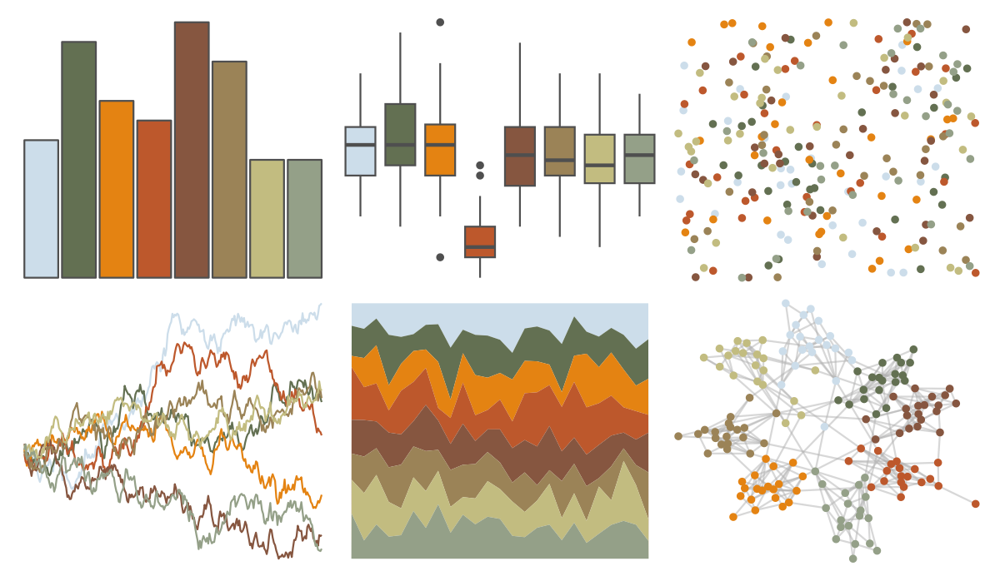

# Redmonder - qMSOOr 

::: columns
::: {.column width="50%"}

**Github**

Not on Github
:::

::: {.column width="50%"}

**CRAN**

[Redmonder](https://CRAN.R-project.org/package=Redmonder)
:::
:::

<hr> 

Use with [paletteer](https://emilhvitfeldt.github.io/paletteer/) package:

```r
library(paletteer)
paletteer_d("Redmonder::qMSOOr")
```

Use raw:

```r
c("#CCDDEAFF", "#637052FF", "#E48312FF", "#BD582CFF", "#865640FF", "#9B8357FF", "#C2BC80FF", "#94A088FF")
``` 

 

<br>

# Related Palettes

<div class="list" style="display: grid; grid-template-columns: auto auto auto;"> <figure class="figure">
<a href="../../awtools/a_palette/"> </a>
</figure> <figure class="figure">
<a href="../../ButterflyColors/hamadryas_feronia/"> </a>
</figure> <figure class="figure">
<a href="../../ButterflyColors/hamadryas_feronia/"> </a>
</figure> <figure class="figure">
<a href="../../Redmonder/qMSOMed/"> </a>
</figure> <figure class="figure">
<a href="../../Redmonder/qMSOYlOr/"> </a>
</figure> <figure class="figure">
<a href="../../Redmonder/qMSOMrq/"> </a>
</figure> <figure class="figure">
<a href="../../calecopal/chaparral1/"> </a>
</figure> <figure class="figure">
<a href="../../lisa/J_M_W_Turner/"> </a>
</figure> <figure class="figure">
<a href="../../palettetown/kingler/"> </a>
</figure> <figure class="figure">
<a href="../../palettetown/baltoy/"> </a>
</figure> <figure class="figure">
<a href="../../yarrr/decision/"> </a>
</figure> <figure class="figure">
<a href="../../IslamicArt/fes/"> </a>
</figure> 
</div>
