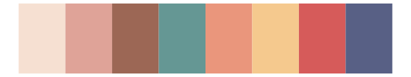
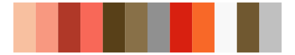

# Redmonder - qMSOOrRd 

::: columns
::: {.column width="50%"}

**Github**

Not on Github
:::

::: {.column width="50%"}

**CRAN**

[Redmonder](https://CRAN.R-project.org/package=Redmonder)
:::
:::

<hr> 

Use with [paletteer](https://emilhvitfeldt.github.io/paletteer/) package:

```r
library(paletteer)
paletteer_d("Redmonder::qMSOOrRd")
```

Use raw:

```r
c("#E9E5DCFF", "#696464FF", "#D34917FF", "#9B2D1FFF", "#A28E6AFF", "#956251FF", "#918485FF", "#855D5DFF")
``` 

 

<br>

# Related Palettes

<div class="list" style="display: grid; grid-template-columns: auto auto auto;"> <figure class="figure">
<a href="../../awtools/a_palette/"> </a>
</figure> <figure class="figure">
<a href="../../palettetown/seaking/"> </a>
</figure> <figure class="figure">
<a href="../../palettetown/voltorb/"> </a>
</figure> <figure class="figure">
<a href="../../MetBrewer/NewKingdom/"> </a>
</figure> <figure class="figure">
<a href="../../tayloRswift/taylor1989/"> </a>
</figure> <figure class="figure">
<a href="../../palettetown/clefairy/"> </a>
</figure> <figure class="figure">
<a href="../../palettetown/electrode/"> </a>
</figure> <figure class="figure">
<a href="../../tvthemes/Day/"> </a>
</figure> <figure class="figure">
<a href="../../ggthemes/Winter/"> </a>
</figure> <figure class="figure">
<a href="../../impressionist.colors/chanteuse_de_cafe_concert/"> </a>
</figure> <figure class="figure">
<a href="../../feathers/oriole/"> </a>
</figure> <figure class="figure">
<a href="../../palettetown/clefable/"> </a>
</figure> 
</div>
