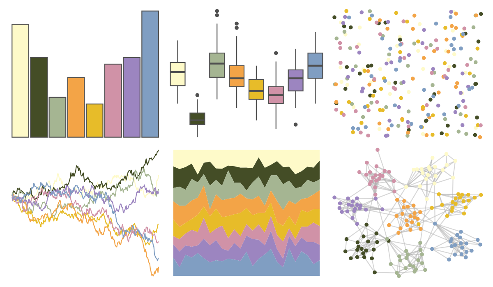
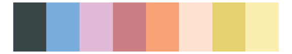
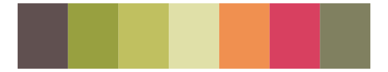
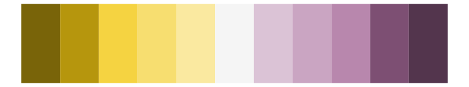
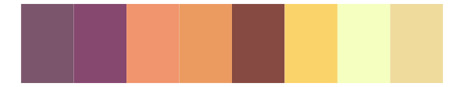
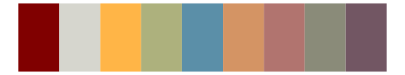

# Redmonder - qMSOPap 

::: columns
::: {.column width="50%"}

**Github**

Not on Github
:::

::: {.column width="50%"}

**CRAN**

[Redmonder](https://CRAN.R-project.org/package=Redmonder)
:::
:::

<hr> 

Use with [paletteer](https://emilhvitfeldt.github.io/paletteer/) package:

```r
library(paletteer)
paletteer_d("Redmonder::qMSOPap")
```

Use raw:

```r
c("#FEFAC9FF", "#444D26FF", "#A5B592FF", "#F3A447FF", "#E7BC29FF", "#D092A7FF", "#9C85C0FF", "#809EC2FF")
``` 

 

<br>

# Related Palettes

<div class="list" style="display: grid; grid-template-columns: auto auto auto;"> <figure class="figure">
<a href="../../awtools/a_palette/"> </a>
</figure> <figure class="figure">
<a href="../../feathers/rose_crowned_fruit_dove/"> </a>
</figure> <figure class="figure">
<a href="../../calecopal/superbloom1/"> </a>
</figure> <figure class="figure">
<a href="../../vapoRwave/floralShoppe/"> </a>
</figure> <figure class="figure">
<a href="../../peRReo/rosalia/"> </a>
</figure> <figure class="figure">
<a href="../../rcartocolor/Temps/"> </a>
</figure> <figure class="figure">
<a href="../../nationalparkcolors/BlueRidgePkwy/"> </a>
</figure> <figure class="figure">
<a href="../../palettetown/baltoy/"> </a>
</figure> <figure class="figure">
<a href="../../Redmonder/dPBIYlPu/"> </a>
</figure> <figure class="figure">
<a href="../../vapoRwave/jwz/"> </a>
</figure> <figure class="figure">
<a href="../../ggsci/light_uchicago/"> </a>
</figure> <figure class="figure">
<a href="../../palettetown/claydol/"> </a>
</figure> 
</div>
