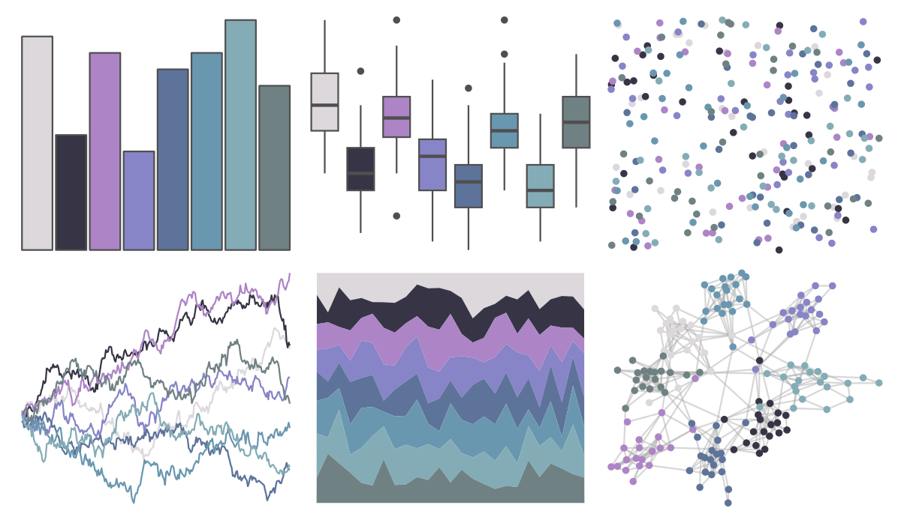

# Redmonder - qMSOPu 

::: columns
::: {.column width="50%"}

**Github**

[pmdci/redmonder](https://github.com/pmdci/redmonder)
:::

::: {.column width="50%"}

**CRAN**

[Redmonder](https://CRAN.R-project.org/package=Redmonder)
:::
:::

<hr> 

Use with [paletteer](https://emilhvitfeldt.github.io/paletteer/) package:

```r
library(paletteer)
paletteer_d("Redmonder::qMSOPu")
```

Use raw:

```r
c("#DCD8DCFF", "#373545FF", "#AD84C6FF", "#8784C7FF", "#5D739AFF", "#6997AFFF", "#84ACB6FF", "#6F8183FF")
``` 

 

<br>

# Related Palettes

<div class="list" style="display: grid; grid-template-columns: auto auto auto;"> <figure class="figure">
<a href="../../amerika/Dem_Ind_Rep3/"> </a>
</figure> <figure class="figure">
<a href="../../palettetown/muk/"> </a>
</figure> <figure class="figure">
<a href="../../ggsci/blue_grey_material/"> </a>
</figure> <figure class="figure">
<a href="../../Manu/Korora/"> </a>
</figure> <figure class="figure">
<a href="../../severance/Half/"> </a>
</figure> <figure class="figure">
<a href="../../palettetown/grimer/"> </a>
</figure> <figure class="figure">
<a href="../../ochRe/dead_reef/"> </a>
</figure> <figure class="figure">
<a href="../../trekcolors/ufp/"> </a>
</figure> <figure class="figure">
<a href="../../palettetown/poliwrath/"> </a>
</figure> <figure class="figure">
<a href="../../trekcolors/andorian/"> </a>
</figure> <figure class="figure">
<a href="../../palettetown/cloyster/"> </a>
</figure> <figure class="figure">
<a href="../../Manu/Kereru/"> </a>
</figure> 
</div>
