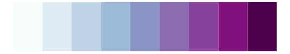
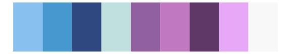

# Redmonder - qMSOPu2 

::: columns
::: {.column width="50%"}

**Github**

Not on Github
:::

::: {.column width="50%"}

**CRAN**

[Redmonder](https://CRAN.R-project.org/package=Redmonder)
:::
:::

<hr> 

Use with [paletteer](https://emilhvitfeldt.github.io/paletteer/) package:

```r
library(paletteer)
paletteer_d("Redmonder::qMSOPu2")
```

Use raw:

```r
c("#EAE5EBFF", "#632E62FF", "#92278FFF", "#9B57D3FF", "#755DD9FF", "#665EB8FF", "#45A5EDFF", "#5982DBFF")
``` 

 

<br>

# Related Palettes

<div class="list" style="display: grid; grid-template-columns: auto auto auto;"> <figure class="figure">
<a href="../../awtools/a_palette/"> </a>
</figure> <figure class="figure">
<a href="../../ggsci/deep_purple_material/"> </a>
</figure> <figure class="figure">
<a href="../../ggsci/indigo_material/"> </a>
</figure> <figure class="figure">
<a href="../../Redmonder/qMSORdPu/"> </a>
</figure> <figure class="figure">
<a href="../../palettetown/zubat/"> </a>
</figure> <figure class="figure">
<a href="../../RColorBrewer/BuPu/"> </a>
</figure> <figure class="figure">
<a href="../../rcartocolor/PurpOr/"> </a>
</figure> <figure class="figure">
<a href="../../ggsci/purple_material/"> </a>
</figure> <figure class="figure">
<a href="../../palettetown/wooper/"> </a>
</figure> <figure class="figure">
<a href="../../beyonce/X51/"> </a>
</figure> <figure class="figure">
<a href="../../ggthemes/excel_Gallery/"> </a>
</figure> <figure class="figure">
<a href="../../trekcolors/ufp/"> </a>
</figure> 
</div>
