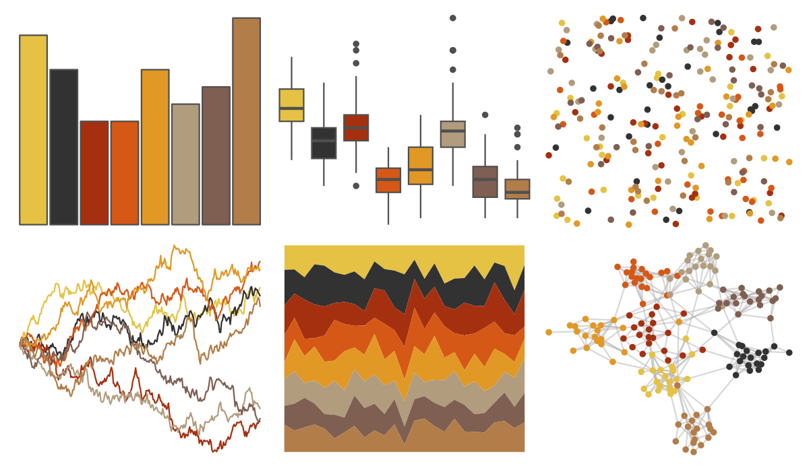

# Redmonder - qMSORd 

::: columns
::: {.column width="50%"}

**Github**

Not on Github
:::

::: {.column width="50%"}

**CRAN**

[Redmonder](https://CRAN.R-project.org/package=Redmonder)
:::
:::

<hr> 

Use with [paletteer](https://emilhvitfeldt.github.io/paletteer/) package:

```r
library(paletteer)
paletteer_d("Redmonder::qMSORd")
```

Use raw:

```r
c("#E5C243FF", "#323232FF", "#A5300FFF", "#D55816FF", "#E19825FF", "#B19C7DFF", "#7F5F52FF", "#B27D49FF")
``` 

 

<br>

# Related Palettes

<div class="list" style="display: grid; grid-template-columns: auto auto auto;"> <figure class="figure">
<a href="../../awtools/a_palette/"> </a>
</figure> <figure class="figure">
<a href="../../ButterflyColors/hamadryas_feronia/"> </a>
</figure> <figure class="figure">
<a href="../../ButterflyColors/hamadryas_feronia/"> </a>
</figure> <figure class="figure">
<a href="../../nord/moose_pond/"> </a>
</figure> <figure class="figure">
<a href="../../colRoz/flavolineata/"> </a>
</figure> <figure class="figure">
<a href="../../NatParksPalettes/SmokyMtns/"> </a>
</figure> <figure class="figure">
<a href="../../rtist/munch/"> </a>
</figure> <figure class="figure">
<a href="../../lisa/MiltonAvery/"> </a>
</figure> <figure class="figure">
<a href="../../palettetown/magcargo/"> </a>
</figure> <figure class="figure">
<a href="../../ggprism/beer_and_ales/"> </a>
</figure> <figure class="figure">
<a href="../../ButterflyColors/lycorea_hallia/"> </a>
</figure> <figure class="figure">
<a href="../../Redmonder/qMSOYl/"> </a>
</figure> 
</div>
