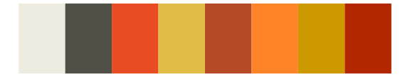

# Redmonder - qMSORdOr 

::: columns
::: {.column width="50%"}

**Github**

Not on Github
:::

::: {.column width="50%"}

**CRAN**

[Redmonder](https://CRAN.R-project.org/package=Redmonder)
:::
:::

<hr> 

Use with [paletteer](https://emilhvitfeldt.github.io/paletteer/) package:

```r
library(paletteer)
paletteer_d("Redmonder::qMSORdOr")
```

Use raw:

```r
c("#EEECE1FF", "#505046FF", "#E84C22FF", "#E1BD47FF", "#B64926FF", "#FF8427FF", "#CC9900FF", "#B22600FF")
``` 

 

<br>

# Related Palettes

<div class="list" style="display: grid; grid-template-columns: auto auto auto;"> <figure class="figure">
<a href="../../awtools/a_palette/"> </a>
</figure> <figure class="figure">
<a href="../../trekcolors/breen2/"> </a>
</figure> <figure class="figure">
<a href="../../palettetown/ninetales/"> </a>
</figure> <figure class="figure">
<a href="../../Redmonder/qMSOYl/"> </a>
</figure> <figure class="figure">
<a href="../../palettetown/krabby/"> </a>
</figure> <figure class="figure">
<a href="../../palettetown/dugtrio/"> </a>
</figure> <figure class="figure">
<a href="../../palettetown/fearow/"> </a>
</figure> <figure class="figure">
<a href="../../palettetown/cleffa/"> </a>
</figure> <figure class="figure">
<a href="../../fishualize/Phractocephalus_hemioliopterus/"> </a>
</figure> <figure class="figure">
<a href="../../palettetown/vulpix/"> </a>
</figure> <figure class="figure">
<a href="../../palettetown/torchic/"> </a>
</figure> <figure class="figure">
<a href="../../palettetown/slugma/"> </a>
</figure> 
</div>
