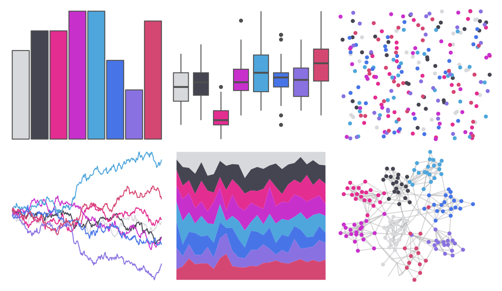
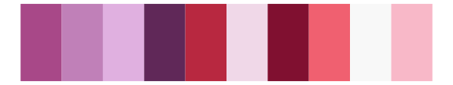

# Redmonder - qMSORdPu 

::: columns
::: {.column width="50%"}

**Github**

[pmdci/redmonder](https://github.com/pmdci/redmonder)
:::

::: {.column width="50%"}

**CRAN**

[Redmonder](https://CRAN.R-project.org/package=Redmonder)
:::
:::

<hr> 

Use with [paletteer](https://emilhvitfeldt.github.io/paletteer/) package:

```r
library(paletteer)
paletteer_d("Redmonder::qMSORdPu")
```

Use raw:

```r
c("#D8D9DCFF", "#454551FF", "#E32D91FF", "#C830CCFF", "#4EA6DCFF", "#4775E7FF", "#8971E1FF", "#D54773FF")
``` 

 

<br>

# Related Palettes

<div class="list" style="display: grid; grid-template-columns: auto auto auto;"> <figure class="figure">
<a href="../../amerika/Dem_Ind_Rep3/"> </a>
</figure> <figure class="figure">
<a href="../../palettetown/zubat/"> </a>
</figure> <figure class="figure">
<a href="../../tvthemes/RoseQuartz/"> </a>
</figure> <figure class="figure">
<a href="../../Redmonder/qMSOPu2/"> </a>
</figure> <figure class="figure">
<a href="../../beyonce/X51/"> </a>
</figure> <figure class="figure">
<a href="../../palettetown/wooper/"> </a>
</figure> <figure class="figure">
<a href="../../PrettyCols/PurplePinks/"> </a>
</figure> <figure class="figure">
<a href="../../palettetown/forretress/"> </a>
</figure> <figure class="figure">
<a href="../../ggthemes/Classic_Purple_Gray_12/"> </a>
</figure> <figure class="figure">
<a href="../../ggthemes/Classic_Purple_Gray_6/"> </a>
</figure> <figure class="figure">
<a href="../../ggthemes/excel_Gallery/"> </a>
</figure> <figure class="figure">
<a href="../../unikn/pal_unikn_dark/"> </a>
</figure> 
</div>
