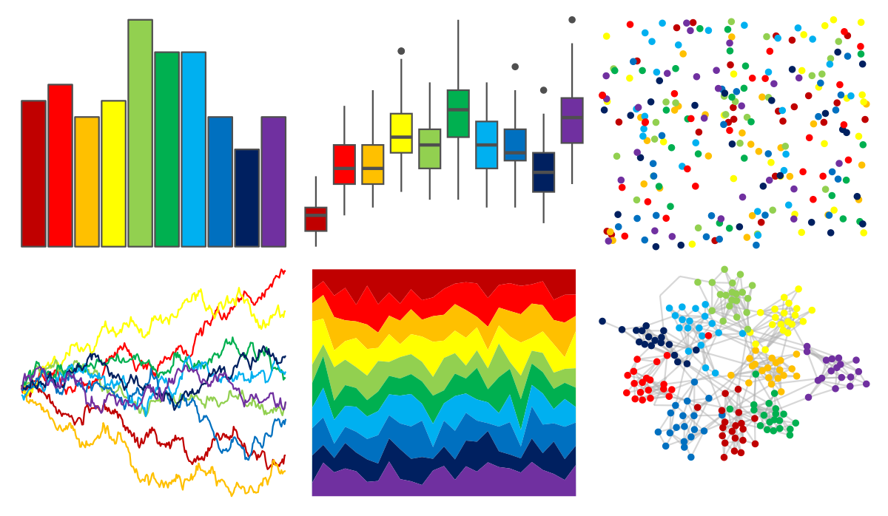

# Redmonder - qMSOStd 

::: columns
::: {.column width="50%"}

**Github**

[pmdci/redmonder](https://github.com/pmdci/redmonder)
:::

::: {.column width="50%"}

**CRAN**

[Redmonder](https://CRAN.R-project.org/package=Redmonder)
:::
:::

<hr> 

Use with [paletteer](https://emilhvitfeldt.github.io/paletteer/) package:

```r
library(paletteer)
paletteer_d("Redmonder::qMSOStd")
```

Use raw:

```r
c("#C00000FF", "#FF0000FF", "#FFC000FF", "#FFFF00FF", "#92D050FF", "#00B050FF", "#00B0F0FF", "#0070C0FF", "#002060FF", "#7030A0FF")
``` 

 

<br>

# Related Palettes

<div class="list" style="display: grid; grid-template-columns: auto auto auto;"> <figure class="figure">
<a href="../../amerika/Dem_Ind_Rep3/"> </a>
</figure> <figure class="figure">
<a href="../../basetheme/deepblue/"> </a>
</figure> <figure class="figure">
<a href="../../jcolors/rainbow/"> </a>
</figure> <figure class="figure">
<a href="../../jcolors/pal3/"> </a>
</figure> <figure class="figure">
<a href="../../ggthemes/calc/"> </a>
</figure> <figure class="figure">
<a href="../../PrettyCols/Rainbow/"> </a>
</figure> <figure class="figure">
<a href="../../LaCroixColoR/KiwiSandia/"> </a>
</figure> <figure class="figure">
<a href="../../LaCroixColoR/PommeBaya/"> </a>
</figure> <figure class="figure">
<a href="../../yarrr/basel/"> </a>
</figure> <figure class="figure">
<a href="../../nbapalettes/bucks_city2/"> </a>
</figure> <figure class="figure">
<a href="../../ggsci/default_frontiers/"> </a>
</figure> <figure class="figure">
<a href="../../LaCroixColoR/CeriseLimon/"> </a>
</figure> 
</div>
