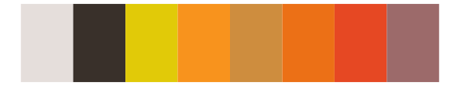
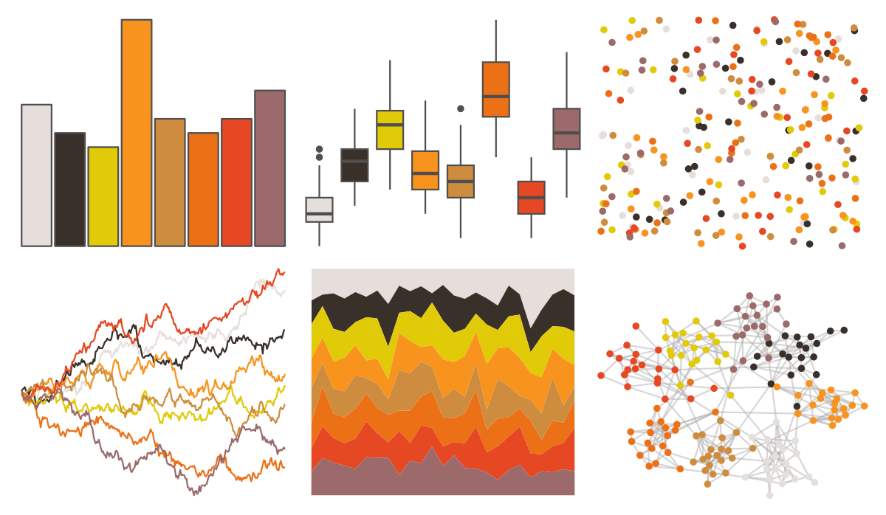
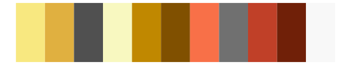

# Redmonder - qMSOYl 

::: columns
::: {.column width="50%"}

**Github**

Not on Github
:::

::: {.column width="50%"}

**CRAN**

[Redmonder](https://CRAN.R-project.org/package=Redmonder)
:::
:::

<hr> 

Use with [paletteer](https://emilhvitfeldt.github.io/paletteer/) package:

```r
library(paletteer)
paletteer_d("Redmonder::qMSOYl")
```

Use raw:

```r
c("#E5DEDBFF", "#39302AFF", "#E1CA08FF", "#F8931DFF", "#CE8D3EFF", "#EC7016FF", "#E64823FF", "#9C6A6AFF")
``` 

 

<br>

# Related Palettes

<div class="list" style="display: grid; grid-template-columns: auto auto auto;"> <figure class="figure">
<a href="../../awtools/a_palette/"> </a>
</figure> <figure class="figure">
<a href="../../palettetown/magcargo/"> </a>
</figure> <figure class="figure">
<a href="../../colRoz/flavolineata/"> </a>
</figure> <figure class="figure">
<a href="../../palettetown/scizor/"> </a>
</figure> <figure class="figure">
<a href="../../Redmonder/qMSORdOr/"> </a>
</figure> <figure class="figure">
<a href="../../palettetown/pichu/"> </a>
</figure> <figure class="figure">
<a href="../../Redmonder/qMSOYlOr/"> </a>
</figure> <figure class="figure">
<a href="../../palettetown/slugma/"> </a>
</figure> <figure class="figure">
<a href="../../palettetown/spinda/"> </a>
</figure> <figure class="figure">
<a href="../../palettetown/octillery/"> </a>
</figure> <figure class="figure">
<a href="../../palettetown/charmeleon/"> </a>
</figure> <figure class="figure">
<a href="../../palettetown/pidgey/"> </a>
</figure> 
</div>
