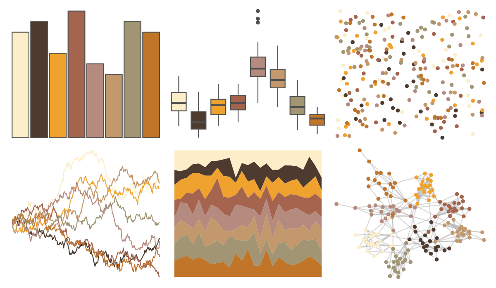

# Redmonder - qMSOYlOr 

::: columns
::: {.column width="50%"}

**Github**

Not on Github
:::

::: {.column width="50%"}

**CRAN**

[Redmonder](https://CRAN.R-project.org/package=Redmonder)
:::
:::

<hr> 

Use with [paletteer](https://emilhvitfeldt.github.io/paletteer/) package:

```r
library(paletteer)
paletteer_d("Redmonder::qMSOYlOr")
```

Use raw:

```r
c("#FBEEC9FF", "#4E3B30FF", "#F0A22EFF", "#A5644EFF", "#B58B80FF", "#C3986DFF", "#A19574FF", "#C17529FF")
``` 

 

<br>

# Related Palettes

<div class="list" style="display: grid; grid-template-columns: auto auto auto;"> <figure class="figure">
<a href="../../awtools/a_palette/"> </a>
</figure> <figure class="figure">
<a href="../../DresdenColor/graveperil/"> </a>
</figure> <figure class="figure">
<a href="../../Redmonder/qMSOOr/"> </a>
</figure> <figure class="figure">
<a href="../../Redmonder/qMSOYl/"> </a>
</figure> <figure class="figure">
<a href="../../palettetown/spinda/"> </a>
</figure> <figure class="figure">
<a href="../../miscpalettes/beach/"> </a>
</figure> <figure class="figure">
<a href="../../colRoz/flavolineata/"> </a>
</figure> <figure class="figure">
<a href="../../IslamicArt/fes/"> </a>
</figure> <figure class="figure">
<a href="../../lisa/JohannJacobUlrich/"> </a>
</figure> <figure class="figure">
<a href="../../palettetown/magcargo/"> </a>
</figure> <figure class="figure">
<a href="../../calecopal/dudleya/"> </a>
</figure> <figure class="figure">
<a href="../../palettetown/pidgey/"> </a>
</figure> 
</div>
