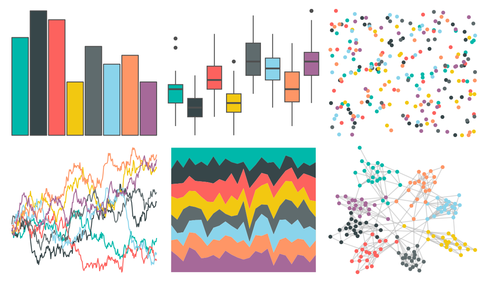

# Redmonder - qPBI 

::: columns
::: {.column width="50%"}

**Github**

[pmdci/redmonder](https://github.com/pmdci/redmonder)
:::

::: {.column width="50%"}

**CRAN**

[Redmonder](https://CRAN.R-project.org/package=Redmonder)
:::
:::

<hr> 

Use with [paletteer](https://emilhvitfeldt.github.io/paletteer/) package:

```r
library(paletteer)
paletteer_d("Redmonder::qPBI")
```

Use raw:

```r
c("#00B8AAFF", "#374649FF", "#FD625EFF", "#F2C811FF", "#5F6B6DFF", "#8AD4EBFF", "#FE9666FF", "#A66999FF")
``` 

 

<br>

# Related Palettes

<div class="list" style="display: grid; grid-template-columns: auto auto auto;"> <figure class="figure">
<a href="../../amerika/Dem_Ind_Rep3/"> </a>
</figure> <figure class="figure">
<a href="../../ggsci/default_nejm/"> </a>
</figure> <figure class="figure">
<a href="../../ggsci/default_flatui/"> </a>
</figure> <figure class="figure">
<a href="../../ggsci/category10_d3/"> </a>
</figure> <figure class="figure">
<a href="../../ggthemes/Classic_10/"> </a>
</figure> <figure class="figure">
<a href="../../khroma/vibrant/"> </a>
</figure> <figure class="figure">
<a href="../../IslamicArt/shiraz2/"> </a>
</figure> <figure class="figure">
<a href="../../ggsci/observable10_observable/"> </a>
</figure> <figure class="figure">
<a href="../../NatParksPalettes/KingsCanyon/"> </a>
</figure> <figure class="figure">
<a href="../../MetBrewer/Nizami/"> </a>
</figure> <figure class="figure">
<a href="../../MetBrewer/Hiroshige/"> </a>
</figure> <figure class="figure">
<a href="../../ltc/crbhits/"> </a>
</figure> 
</div>
