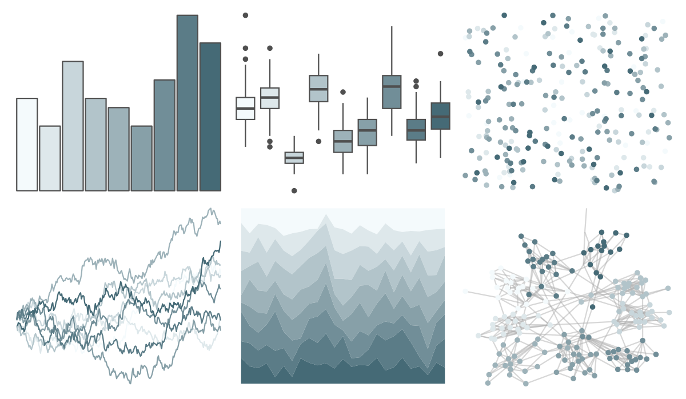

# Redmonder - sPBIBu 

::: columns
::: {.column width="50%"}

**Github**

Not on Github
:::

::: {.column width="50%"}

**CRAN**

[Redmonder](https://CRAN.R-project.org/package=Redmonder)
:::
:::

<hr> 

Use with [paletteer](https://emilhvitfeldt.github.io/paletteer/) package:

```r
library(paletteer)
paletteer_d("Redmonder::sPBIBu")
```

Use raw:

```r
c("#F4FAFCFF", "#DEE8EBFF", "#C8D6DBFF", "#B2C4CAFF", "#9DB2B9FF", "#87A0A8FF", "#718E98FF", "#5B7C87FF", "#456A76FF")
``` 

 

<br>

# Related Palettes

<div class="list" style="display: grid; grid-template-columns: auto auto auto;"> <figure class="figure">
<a href="../../awtools/a_palette/"> </a>
</figure> <figure class="figure">
<a href="../../ButterflyColors/hamadryas_feronia/"> </a>
</figure> <figure class="figure">
<a href="../../ButterflyColors/hamadryas_feronia/"> </a>
</figure> <figure class="figure">
<a href="../../nord/afternoon_prarie/"> </a>
</figure> <figure class="figure">
<a href="../../fishualize/Opisthonema_oglinum/"> </a>
</figure> <figure class="figure">
<a href="../../ochRe/dead_reef/"> </a>
</figure> <figure class="figure">
<a href="../../rcartocolor/Teal/"> </a>
</figure> <figure class="figure">
<a href="../../palettetown/dewgong/"> </a>
</figure> <figure class="figure">
<a href="../../ghibli/YesterdayLight/"> </a>
</figure> <figure class="figure">
<a href="../../musculusColors/Bmsurface/"> </a>
</figure> <figure class="figure">
<a href="../../Redmonder/qMSOPu/"> </a>
</figure> <figure class="figure">
<a href="../../ghibli/LaputaLight/"> </a>
</figure> 
</div>
