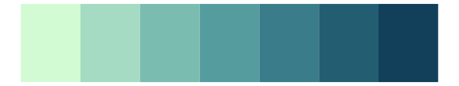

# Redmonder - sPBIGn 

::: columns
::: {.column width="50%"}

**Github**

Not on Github
:::

::: {.column width="50%"}

**CRAN**

[Redmonder](https://CRAN.R-project.org/package=Redmonder)
:::
:::

<hr> 

Use with [paletteer](https://emilhvitfeldt.github.io/paletteer/) package:

```r
library(paletteer)
paletteer_d("Redmonder::sPBIGn")
```

Use raw:

```r
c("#E9F8F6FF", "#CCE5E2FF", "#AFD1CEFF", "#92BEBAFF", "#75AAA6FF", "#579791FF", "#3A837DFF", "#1D7069FF", "#005C55FF")
``` 

 

<br>

# Related Palettes

<div class="list" style="display: grid; grid-template-columns: auto auto auto;"> <figure class="figure">
<a href="../../awtools/a_palette/"> </a>
</figure> <figure class="figure">
<a href="../../rcartocolor/Mint/"> </a>
</figure> <figure class="figure">
<a href="../../ggsci/teal_material/"> </a>
</figure> <figure class="figure">
<a href="../../miscpalettes/seaGreen/"> </a>
</figure> <figure class="figure">
<a href="../../RColorBrewer/PuBuGn/"> </a>
</figure> <figure class="figure">
<a href="../../fishualize/Sardinella_brasiliensis/"> </a>
</figure> <figure class="figure">
<a href="../../musculusColors/Bmlunge/"> </a>
</figure> <figure class="figure">
<a href="../../ggsci/cyan_material/"> </a>
</figure> <figure class="figure">
<a href="../../rcartocolor/DarkMint/"> </a>
</figure> <figure class="figure">
<a href="../../trekcolors/romulan2/"> </a>
</figure> <figure class="figure">
<a href="../../colorBlindness/Blue2Gray8Steps/"> </a>
</figure> <figure class="figure">
<a href="../../soilpalettes/gley/"> </a>
</figure> 
</div>
