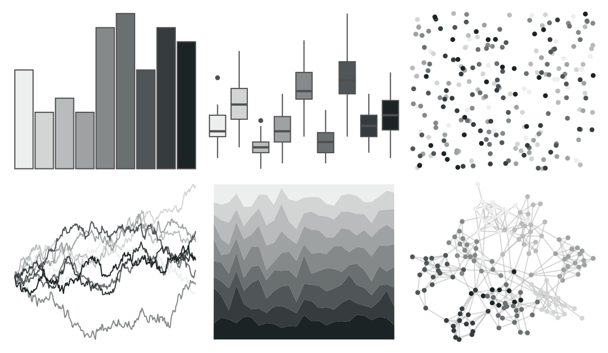

# Redmonder - sPBIGy1 

::: columns
::: {.column width="50%"}

**Github**

[pmdci/redmonder](https://github.com/pmdci/redmonder)
:::

::: {.column width="50%"}

**CRAN**

[Redmonder](https://CRAN.R-project.org/package=Redmonder)
:::
:::

<hr> 

Use with [paletteer](https://emilhvitfeldt.github.io/paletteer/) package:

```r
library(paletteer)
paletteer_d("Redmonder::sPBIGy1")
```

Use raw:

```r
c("#EDEEEEFF", "#D3D5D5FF", "#B9BBBCFF", "#9FA2A3FF", "#85898AFF", "#6A6F70FF", "#505657FF", "#363C3EFF", "#1C2325FF")
``` 

 

<br>

# Related Palettes

<div class="list" style="display: grid; grid-template-columns: auto auto auto;"> <figure class="figure">
<a href="../../amerika/Dem_Ind_Rep3/"> </a>
</figure> <figure class="figure">
<a href="../../Redmonder/sPBIGy2/"> </a>
</figure> <figure class="figure">
<a href="../../ggsci/gray_bs5/"> </a>
</figure> <figure class="figure">
<a href="../../trekcolors/borg/"> </a>
</figure> <figure class="figure">
<a href="../../ggsci/blue_grey_material/"> </a>
</figure> <figure class="figure">
<a href="../../ggthemes/Classic_Gray_5/"> </a>
</figure> <figure class="figure">
<a href="../../tayloRswift/midnights/"> </a>
</figure> <figure class="figure">
<a href="../../Redmonder/sPBIPu/"> </a>
</figure> <figure class="figure">
<a href="../../PNWColors/Winter/"> </a>
</figure> <figure class="figure">
<a href="../../ggprism/black_and_white/"> </a>
</figure> <figure class="figure">
<a href="../../Redmonder/qMSOPu/"> </a>
</figure> <figure class="figure">
<a href="../../PrettyCols/Greys/"> </a>
</figure> 
</div>
