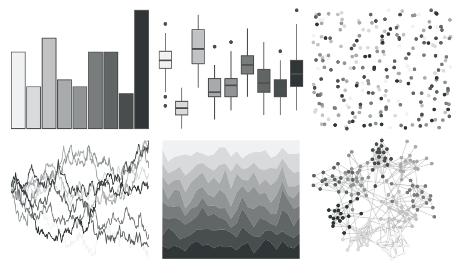

# Redmonder - sPBIGy2 

::: columns
::: {.column width="50%"}

**Github**

Not on Github
:::

::: {.column width="50%"}

**CRAN**

[Redmonder](https://CRAN.R-project.org/package=Redmonder)
:::
:::

<hr> 

Use with [paletteer](https://emilhvitfeldt.github.io/paletteer/) package:

```r
library(paletteer)
paletteer_d("Redmonder::sPBIGy2")
```

Use raw:

```r
c("#F0F1F2FF", "#D8DADBFF", "#C0C2C3FF", "#A8ABACFF", "#909495FF", "#787C7DFF", "#606566FF", "#484D4EFF", "#303637FF")
``` 

 

<br>

# Related Palettes

<div class="list" style="display: grid; grid-template-columns: auto auto auto;"> <figure class="figure">
<a href="../../awtools/a_palette/"> </a>
</figure> <figure class="figure">
<a href="../../Redmonder/sPBIGy1/"> </a>
</figure> <figure class="figure">
<a href="../../unikn/pal_grau/"> </a>
</figure> <figure class="figure">
<a href="../../ggthemes/Classic_Gray_5/"> </a>
</figure> <figure class="figure">
<a href="../../ggthemes/excel_Grayscale/"> </a>
</figure> <figure class="figure">
<a href="../../ochRe/dead_reef/"> </a>
</figure> <figure class="figure">
<a href="../../ggthemes/Seattle_Grays/"> </a>
</figure> <figure class="figure">
<a href="../../Redmonder/sPBIPu/"> </a>
</figure> <figure class="figure">
<a href="../../trekcolors/borg/"> </a>
</figure> <figure class="figure">
<a href="../../ggsci/grey_material/"> </a>
</figure> <figure class="figure">
<a href="../../ggsci/blue_grey_material/"> </a>
</figure> <figure class="figure">
<a href="../../musculusColors/ErWhale/"> </a>
</figure> 
</div>
