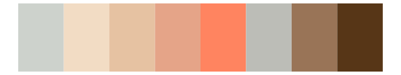

# Redmonder - sPBIOr 

::: columns
::: {.column width="50%"}

**Github**

Not on Github
:::

::: {.column width="50%"}

**CRAN**

[Redmonder](https://CRAN.R-project.org/package=Redmonder)
:::
:::

<hr> 

Use with [paletteer](https://emilhvitfeldt.github.io/paletteer/) package:

```r
library(paletteer)
paletteer_d("Redmonder::sPBIOr")
```

Use raw:

```r
c("#FDF5F1FF", "#EDE0D9FF", "#DECBC2FF", "#CEB5AAFF", "#BEA092FF", "#AE8B7AFF", "#9F7663FF", "#8F604BFF", "#7F4B33FF")
``` 

 

<br>

# Related Palettes

<div class="list" style="display: grid; grid-template-columns: auto auto auto;"> <figure class="figure">
<a href="../../awtools/a_palette/"> </a>
</figure> <figure class="figure">
<a href="../../beyonce/X55/"> </a>
</figure> <figure class="figure">
<a href="../../Redmonder/sPBIRd/"> </a>
</figure> <figure class="figure">
<a href="../../fishualize/Anchoviella_lepidentostole/"> </a>
</figure> <figure class="figure">
<a href="../../fishualize/Lutjanus_jocu/"> </a>
</figure> <figure class="figure">
<a href="../../beyonce/X52/"> </a>
</figure> <figure class="figure">
<a href="../../trekcolors/iconian/"> </a>
</figure> <figure class="figure">
<a href="../../nationalparkcolors/BryceCanyon/"> </a>
</figure> <figure class="figure">
<a href="../../miscpalettes/beach/"> </a>
</figure> <figure class="figure">
<a href="../../fishualize/Esox_lucius/"> </a>
</figure> <figure class="figure">
<a href="../../impressionist.colors/chanteuse_de_cafe_concert/"> </a>
</figure> <figure class="figure">
<a href="../../beyonce/X50/"> </a>
</figure> 
</div>
