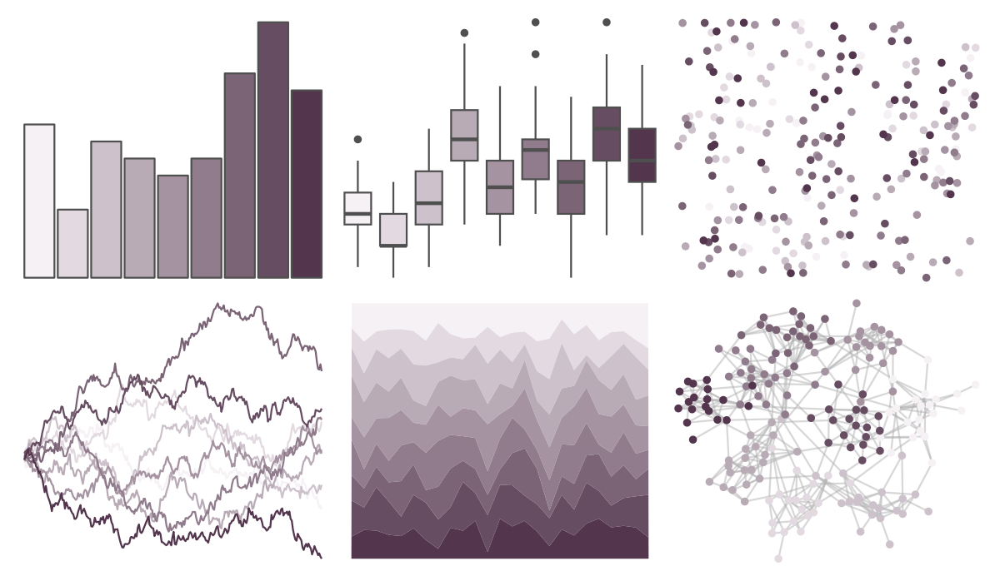

# Redmonder - sPBIPu 

::: columns
::: {.column width="50%"}

**Github**

[pmdci/redmonder](https://github.com/pmdci/redmonder)
:::

::: {.column width="50%"}

**CRAN**

[Redmonder](https://CRAN.R-project.org/package=Redmonder)
:::
:::

<hr> 

Use with [paletteer](https://emilhvitfeldt.github.io/paletteer/) package:

```r
library(paletteer)
paletteer_d("Redmonder::sPBIPu")
```

Use raw:

```r
c("#F6F1F5FF", "#E2DAE0FF", "#CDC2CBFF", "#B9ABB6FF", "#A593A1FF", "#907C8CFF", "#7C6477FF", "#674D62FF", "#53354DFF")
``` 

 

<br>

# Related Palettes

<div class="list" style="display: grid; grid-template-columns: auto auto auto;"> <figure class="figure">
<a href="../../amerika/Dem_Ind_Rep3/"> </a>
</figure> <figure class="figure">
<a href="../../palettetown/grimer/"> </a>
</figure> <figure class="figure">
<a href="../../palettetown/muk/"> </a>
</figure> <figure class="figure">
<a href="../../tvthemes/Night/"> </a>
</figure> <figure class="figure">
<a href="../../Rdune/corrino/"> </a>
</figure> <figure class="figure">
<a href="../../Manu/Kiwi/"> </a>
</figure> <figure class="figure">
<a href="../../calecopal/calochortus/"> </a>
</figure> <figure class="figure">
<a href="../../nord/halifax_harbor/"> </a>
</figure> <figure class="figure">
<a href="../../Redmonder/sPBIGy2/"> </a>
</figure> <figure class="figure">
<a href="../../ggsci/brown_material/"> </a>
</figure> <figure class="figure">
<a href="../../musculusColors/ErWhale/"> </a>
</figure> <figure class="figure">
<a href="../../Redmonder/sPBIGy1/"> </a>
</figure> 
</div>
