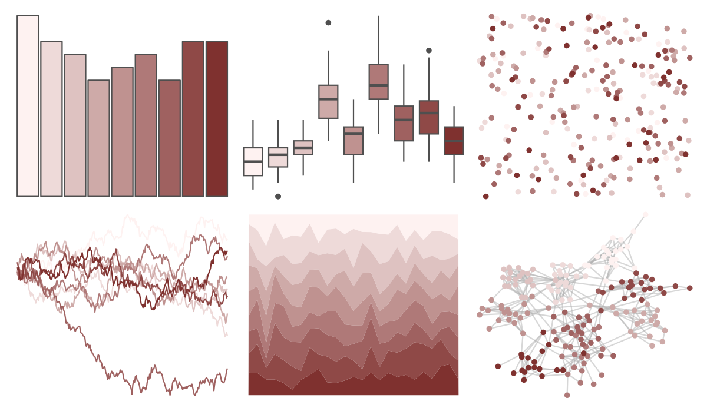

# Redmonder - sPBIRd 

::: columns
::: {.column width="50%"}

**Github**

[pmdci/redmonder](https://github.com/pmdci/redmonder)
:::

::: {.column width="50%"}

**CRAN**

[Redmonder](https://CRAN.R-project.org/package=Redmonder)
:::
:::

<hr> 

Use with [paletteer](https://emilhvitfeldt.github.io/paletteer/) package:

```r
library(paletteer)
paletteer_d("Redmonder::sPBIRd")
```

Use raw:

```r
c("#FEF2F1FF", "#EEDAD9FF", "#DEC2C1FF", "#CEAAA8FF", "#BF9290FF", "#AF7978FF", "#9F6160FF", "#8F4947FF", "#7F312FFF")
``` 

 

<br>

# Related Palettes

<div class="list" style="display: grid; grid-template-columns: auto auto auto;"> <figure class="figure">
<a href="../../amerika/Dem_Ind_Rep3/"> </a>
</figure> <figure class="figure">
<a href="../../Redmonder/sPBIOr/"> </a>
</figure> <figure class="figure">
<a href="../../palettetown/blissey/"> </a>
</figure> <figure class="figure">
<a href="../../beyonce/X55/"> </a>
</figure> <figure class="figure">
<a href="../../trekcolors/iconian/"> </a>
</figure> <figure class="figure">
<a href="../../ochRe/galah/"> </a>
</figure> <figure class="figure">
<a href="../../Redmonder/dPBIPuOr/"> </a>
</figure> <figure class="figure">
<a href="../../PrettyCols/Reds/"> </a>
</figure> <figure class="figure">
<a href="../../soilpalettes/crait/"> </a>
</figure> <figure class="figure">
<a href="../../MetBrewer/Morgenstern/"> </a>
</figure> <figure class="figure">
<a href="../../beyonce/X44/"> </a>
</figure> <figure class="figure">
<a href="../../rcartocolor/BurgYl/"> </a>
</figure> 
</div>
