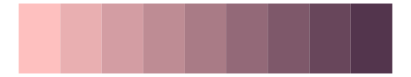
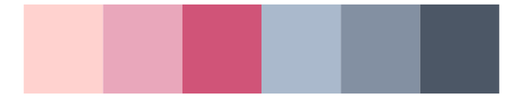

# Redmonder - sPBIRdPu 

::: columns
::: {.column width="50%"}

**Github**

Not on Github
:::

::: {.column width="50%"}

**CRAN**

[Redmonder](https://CRAN.R-project.org/package=Redmonder)
:::
:::

<hr> 

Use with [paletteer](https://emilhvitfeldt.github.io/paletteer/) package:

```r
library(paletteer)
paletteer_d("Redmonder::sPBIRdPu")
```

Use raw:

```r
c("#FEC0BFFF", "#E9AFB1FF", "#D39DA3FF", "#BE8C94FF", "#A97B86FF", "#936978FF", "#7E586AFF", "#68465BFF", "#53354DFF")
``` 

 

<br>

# Related Palettes

<div class="list" style="display: grid; grid-template-columns: auto auto auto;"> <figure class="figure">
<a href="../../awtools/a_palette/"> </a>
</figure> <figure class="figure">
<a href="../../rcartocolor/Burg/"> </a>
</figure> <figure class="figure">
<a href="../../unikn/pal_bordeaux/"> </a>
</figure> <figure class="figure">
<a href="../../tvthemes/Dusk/"> </a>
</figure> <figure class="figure">
<a href="../../MapPalettes/bruiser/"> </a>
</figure> <figure class="figure">
<a href="../../rcartocolor/Magenta/"> </a>
</figure> <figure class="figure">
<a href="../../fishualize/Labrisomus_cricota/"> </a>
</figure> <figure class="figure">
<a href="../../PNWColors/Starfish/"> </a>
</figure> <figure class="figure">
<a href="../../yarrr/usualsuspects/"> </a>
</figure> <figure class="figure">
<a href="../../Redmonder/sPBIRd/"> </a>
</figure> <figure class="figure">
<a href="../../feathers/galah/"> </a>
</figure> <figure class="figure">
<a href="../../rcartocolor/PurpOr/"> </a>
</figure> 
</div>
