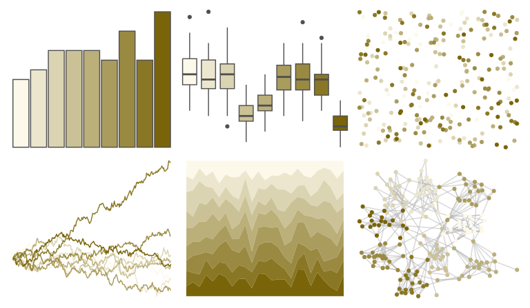

# Redmonder - sPBIYl 

::: columns
::: {.column width="50%"}

**Github**

Not on Github
:::

::: {.column width="50%"}

**CRAN**

[Redmonder](https://CRAN.R-project.org/package=Redmonder)
:::
:::

<hr> 

Use with [paletteer](https://emilhvitfeldt.github.io/paletteer/) package:

```r
library(paletteer)
paletteer_d("Redmonder::sPBIYl")
```

Use raw:

```r
c("#FCF9EAFF", "#ECE6CEFF", "#DBD4B2FF", "#CBC196FF", "#BBAF7AFF", "#AA9C5DFF", "#9A8941FF", "#897725FF", "#796409FF")
``` 

 

<br>

# Related Palettes

<div class="list" style="display: grid; grid-template-columns: auto auto auto;"> <figure class="figure">
<a href="../../awtools/a_palette/"> </a>
</figure> <figure class="figure">
<a href="../../palettetown/eevee/"> </a>
</figure> <figure class="figure">
<a href="../../fishualize/Paralabrax_clathratus/"> </a>
</figure> <figure class="figure">
<a href="../../beyonce/X23/"> </a>
</figure> <figure class="figure">
<a href="../../palettetown/diglett/"> </a>
</figure> <figure class="figure">
<a href="../../ggprism/mustard_field2/"> </a>
</figure> <figure class="figure">
<a href="../../palettetown/shedinja/"> </a>
</figure> <figure class="figure">
<a href="../../palettetown/graveler/"> </a>
</figure> <figure class="figure">
<a href="../../palettetown/psyduck/"> </a>
</figure> <figure class="figure">
<a href="../../Manu/Kakapo/"> </a>
</figure> <figure class="figure">
<a href="../../impressionist.colors/melon_et_peches/"> </a>
</figure> <figure class="figure">
<a href="../../lisa/RemediosVaro/"> </a>
</figure> 
</div>
