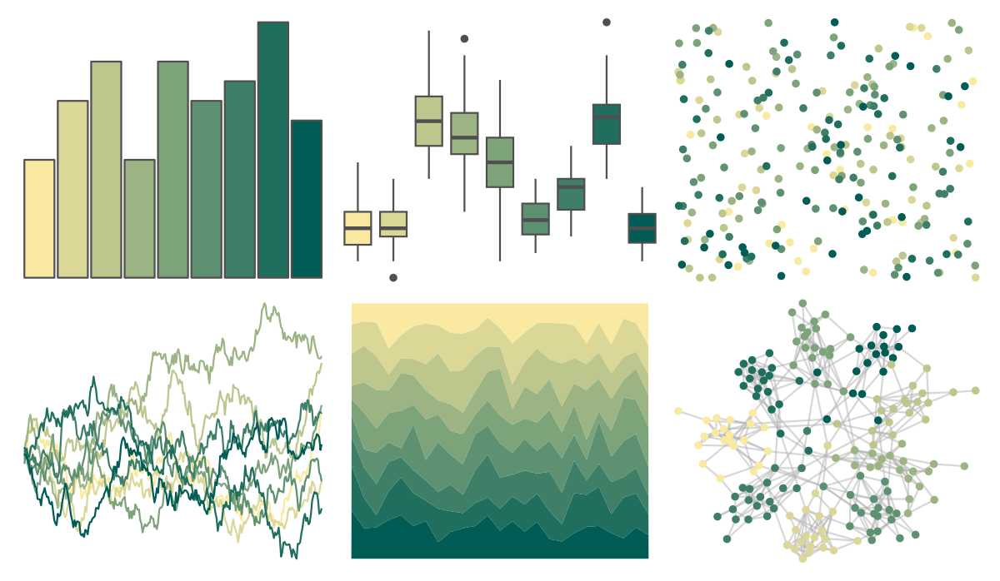

# Redmonder - sPBIYlGn 

::: columns
::: {.column width="50%"}

**Github**

[pmdci/redmonder](https://github.com/pmdci/redmonder)
:::

::: {.column width="50%"}

**CRAN**

[Redmonder](https://CRAN.R-project.org/package=Redmonder)
:::
:::

<hr> 

Use with [paletteer](https://emilhvitfeldt.github.io/paletteer/) package:

```r
library(paletteer)
paletteer_d("Redmonder::sPBIYlGn")
```

Use raw:

```r
c("#FAE9A0FF", "#DBD797FF", "#BCC68DFF", "#9CB484FF", "#7DA37BFF", "#5E9171FF", "#3F7F68FF", "#1F6E5EFF", "#005C55FF")
``` 

 

<br>

# Related Palettes

<div class="list" style="display: grid; grid-template-columns: auto auto auto;"> <figure class="figure">
<a href="../../amerika/Dem_Ind_Rep3/"> </a>
</figure> <figure class="figure">
<a href="../../Redmonder/qMSOGn/"> </a>
</figure> <figure class="figure">
<a href="../../Redmonder/qMSOGnYl/"> </a>
</figure> <figure class="figure">
<a href="../../impressionist.colors/melon_et_peches/"> </a>
</figure> <figure class="figure">
<a href="../../ggprism/quiet2/"> </a>
</figure> <figure class="figure">
<a href="../../ggprism/quiet/"> </a>
</figure> <figure class="figure">
<a href="../../ochRe/jumping_frog/"> </a>
</figure> <figure class="figure">
<a href="../../ghibli/MarnieMedium2/"> </a>
</figure> <figure class="figure">
<a href="../../palettetown/omastar/"> </a>
</figure> <figure class="figure">
<a href="../../nationalparkcolors/Voyageurs/"> </a>
</figure> <figure class="figure">
<a href="../../calecopal/sierra2/"> </a>
</figure> <figure class="figure">
<a href="../../palettetown/omanyte/"> </a>
</figure> 
</div>
