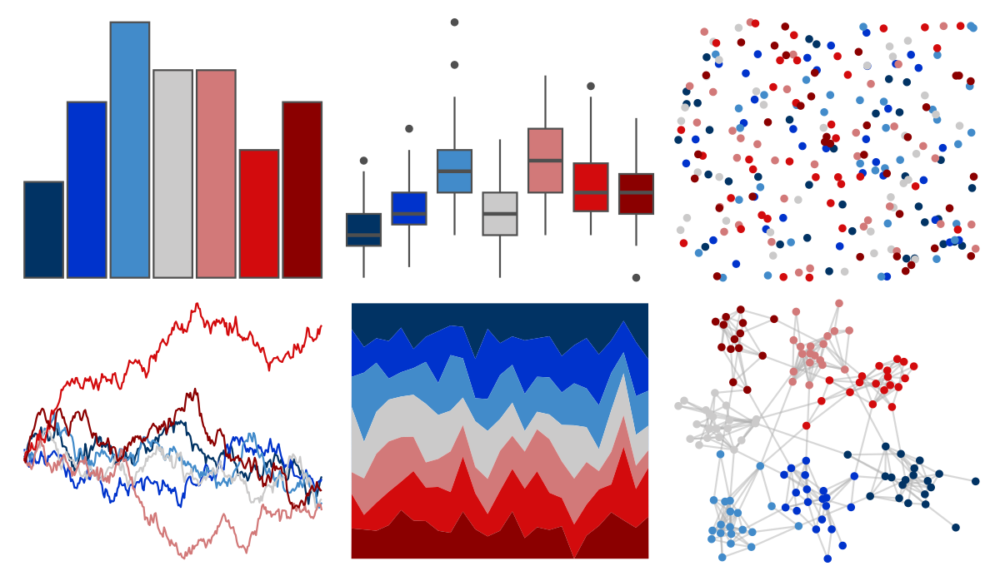

# amerika - Dem_Ind_Rep7 

::: columns
::: {.column width="50%"}

**Github**

[pdwaggoner/amerika](https://github.com/pdwaggoner/amerika)
:::

::: {.column width="50%"}

**CRAN**

[amerika](https://CRAN.R-project.org/package=amerika)
:::
:::

<hr> 

Use with [paletteer](https://emilhvitfeldt.github.io/paletteer/) package:

```r
library(paletteer)
paletteer_d("amerika::Dem_Ind_Rep7")
```

Use raw:

```r
c("#013364FF", "#0033CCFF", "#428BCAFF", "#CBCACAFF", "#D27979FF", "#D30B0DFF", "#8B0000FF")
``` 

 

<br>

# Related Palettes

<div class="list" style="display: grid; grid-template-columns: auto auto auto;"> <figure class="figure">
<a href="../../amerika/Dem_Ind_Rep3/"> </a>
</figure> <figure class="figure">
<a href="../../amerika/Dem_Ind_Rep5/"> </a>
</figure> <figure class="figure">
<a href="../../nbapalettes/pistons_city/"> </a>
</figure> <figure class="figure">
<a href="../../nbapalettes/pistons/"> </a>
</figure> <figure class="figure">
<a href="../../nbapalettes/sixers_city/"> </a>
</figure> <figure class="figure">
<a href="../../trekcolors/lcars_2379/"> </a>
</figure> <figure class="figure">
<a href="../../awtools/a_palette/"> </a>
</figure> <figure class="figure">
<a href="../../ggthemr/solarized/"> </a>
</figure> <figure class="figure">
<a href="../../nbapalettes/timberwolves_statement/"> </a>
</figure> <figure class="figure">
<a href="../../palettetown/beldum/"> </a>
</figure> <figure class="figure">
<a href="../../suffrager/oxon/"> </a>
</figure> <figure class="figure">
<a href="../../NatParksPalettes/Arches/"> </a>
</figure> 
</div>
