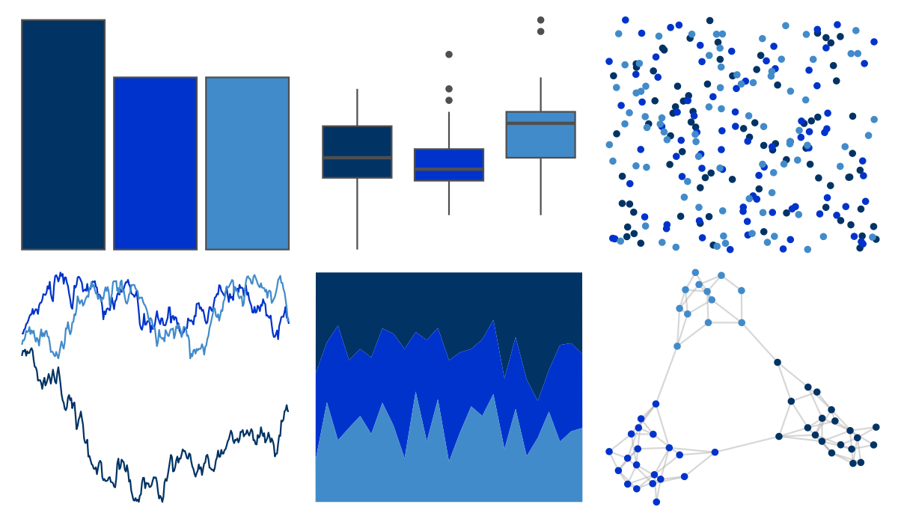

# amerika - Democrat 

::: columns
::: {.column width="50%"}

**Github**

[pdwaggoner/amerika](https://github.com/pdwaggoner/amerika)
:::

::: {.column width="50%"}

**CRAN**

[amerika](https://CRAN.R-project.org/package=amerika)
:::
:::

<hr> 

Use with [paletteer](https://emilhvitfeldt.github.io/paletteer/) package:

```r
library(paletteer)
paletteer_d("amerika::Democrat")
```

Use raw:

```r
c("#013364FF", "#0033CCFF", "#428BCAFF")
``` 

 

<br>

# Related Palettes

<div class="list" style="display: grid; grid-template-columns: auto auto auto;"> <figure class="figure">
<a href="../../amerika/Dem_Ind_Rep3/"> </a>
</figure> <figure class="figure">
<a href="../../nbapalettes/thunder_statement/"> </a>
</figure> <figure class="figure">
<a href="../../nbapalettes/clippers_retro/"> </a>
</figure> <figure class="figure">
<a href="../../nbapalettes/kings_alt2/"> </a>
</figure> <figure class="figure">
<a href="../../nbapalettes/kings/"> </a>
</figure> <figure class="figure">
<a href="../../palettesForR/Cool/"> </a>
</figure> <figure class="figure">
<a href="../../nbapalettes/rockets_city/"> </a>
</figure> <figure class="figure">
<a href="../../nbapalettes/hornets/"> </a>
</figure> <figure class="figure">
<a href="../../poisonfrogs/Dtazureus/"> </a>
</figure> <figure class="figure">
<a href="../../nbapalettes/magic/"> </a>
</figure> <figure class="figure">
<a href="../../fishualize/Acanthurus_chirurgus/"> </a>
</figure> <figure class="figure">
<a href="../../ggthemes/excel_Violet_II/"> </a>
</figure> 
</div>
