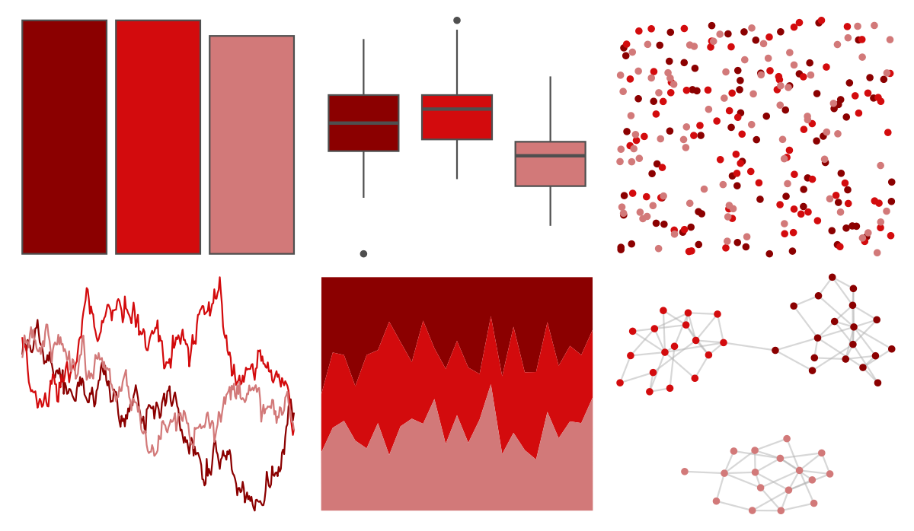

# amerika - Republican 

::: columns
::: {.column width="50%"}

**Github**

[pdwaggoner/amerika](https://github.com/pdwaggoner/amerika)
:::

::: {.column width="50%"}

**CRAN**

[amerika](https://CRAN.R-project.org/package=amerika)
:::
:::

<hr> 

Use with [paletteer](https://emilhvitfeldt.github.io/paletteer/) package:

```r
library(paletteer)
paletteer_d("amerika::Republican")
```

Use raw:

```r
c("#8B0000FF", "#D30B0DFF", "#D27979FF")
``` 

 

<br>

# Related Palettes

<div class="list" style="display: grid; grid-template-columns: auto auto auto;"> <figure class="figure">
<a href="../../amerika/Dem_Ind_Rep3/"> </a>
</figure> <figure class="figure">
<a href="../../nbapalettes/suns_retro/"> </a>
</figure> <figure class="figure">
<a href="../../fishualize/Heretopriacanthus_cruentatus/"> </a>
</figure> <figure class="figure">
<a href="../../fishualize/Acanthostracion_polygonius_y/"> </a>
</figure> <figure class="figure">
<a href="../../trekcolors/red_alert/"> </a>
</figure> <figure class="figure">
<a href="../../nbapalettes/blazers_statement/"> </a>
</figure> <figure class="figure">
<a href="../../fishualize/Sparisoma_tuyupiranga_f/"> </a>
</figure> <figure class="figure">
<a href="../../nbapalettes/cavaliers_90s/"> </a>
</figure> <figure class="figure">
<a href="../../fishualize/Sargocentron_bullisi/"> </a>
</figure> <figure class="figure">
<a href="../../waRhol/camo_87_2/"> </a>
</figure> <figure class="figure">
<a href="../../lisa/TerryFrost/"> </a>
</figure> <figure class="figure">
<a href="../../ggprism/autumn_leaves/"> </a>
</figure> 
</div>
