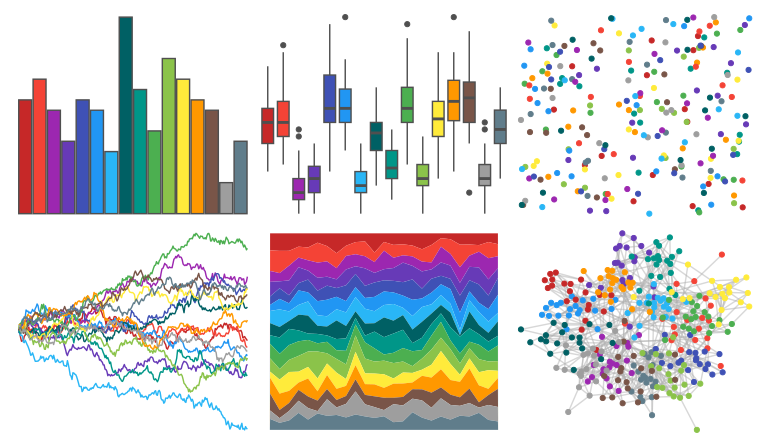

# awtools - bpalette 

::: columns
::: {.column width="50%"}

**Github**

[awhstin/awtools](https://github.com/awhstin/awtools)
:::

::: {.column width="50%"}

**CRAN**

Not on CRAN
:::
:::

<hr> 

Use with [paletteer](https://emilhvitfeldt.github.io/paletteer/) package:

```r
library(paletteer)
paletteer_d("awtools::bpalette")
```

Use raw:

```r
c("#C62828FF", "#F44336FF", "#9C27B0FF", "#673AB7FF", "#3F51B5FF", "#2196F3FF", "#29B6F6FF", "#006064FF", "#009688FF", "#4CAF50FF", "#8BC34AFF", "#FFEB3BFF", "#FF9800FF", "#795548FF", "#9E9E9EFF", "#607D8BFF")
``` 

 

<br>

# Related Palettes

<div class="list" style="display: grid; grid-template-columns: auto auto auto;"> <figure class="figure">
<a href="../../awtools/a_palette/"> </a>
</figure> <figure class="figure">
<a href="../../rcartocolor/Bold/"> </a>
</figure> <figure class="figure">
<a href="../../rcartocolor/Vivid/"> </a>
</figure> <figure class="figure">
<a href="../../rcartocolor/Prism/"> </a>
</figure> <figure class="figure">
<a href="../../DresdenColor/paired/"> </a>
</figure> <figure class="figure">
<a href="../../MetBrewer/Signac/"> </a>
</figure> <figure class="figure">
<a href="../../ggthemes/Classic_Cyclic/"> </a>
</figure> <figure class="figure">
<a href="../../yarrr/info2/"> </a>
</figure> <figure class="figure">
<a href="../../tidyquant/tq_light/"> </a>
</figure> <figure class="figure">
<a href="../../miscpalettes/brightPastel/"> </a>
</figure> <figure class="figure">
<a href="../../ggthemr/flat/"> </a>
</figure> <figure class="figure">
<a href="../../tidyquant/tq_dark/"> </a>
</figure> 
</div>
