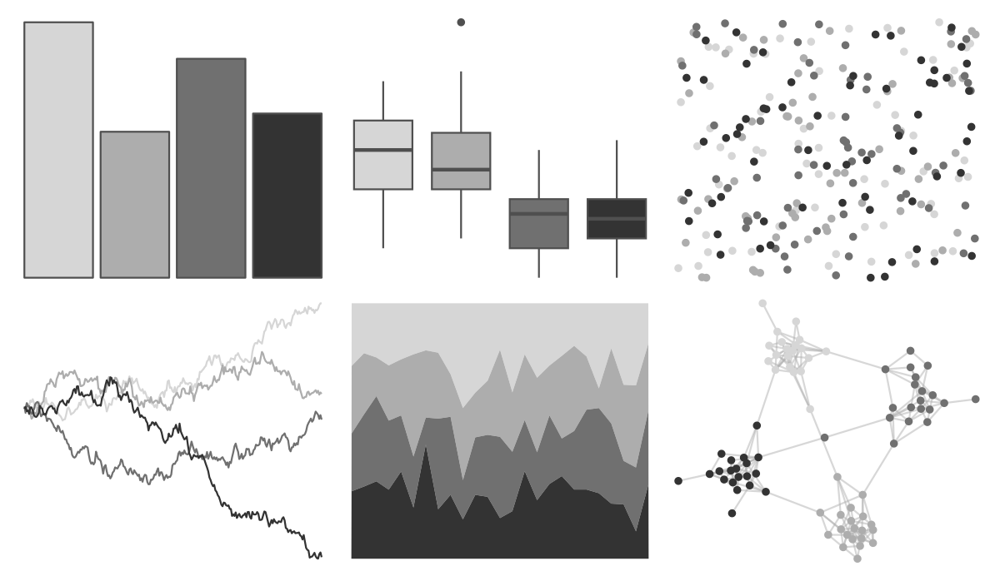
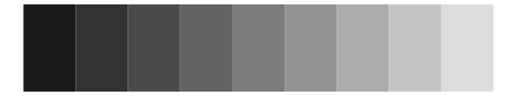

# awtools - gpalette 

::: columns
::: {.column width="50%"}

**Github**

[awhstin/awtools](https://github.com/awhstin/awtools)
:::

::: {.column width="50%"}

**CRAN**

Not on CRAN
:::
:::

<hr> 

Use with [paletteer](https://emilhvitfeldt.github.io/paletteer/) package:

```r
library(paletteer)
paletteer_d("awtools::gpalette")
```

Use raw:

```r
c("#D6D6D6FF", "#ADADADFF", "#707070FF", "#333333FF")
``` 

 

<br>

# Related Palettes

<div class="list" style="display: grid; grid-template-columns: auto auto auto;"> <figure class="figure">
<a href="../../amerika/Dem_Ind_Rep3/"> </a>
</figure> <figure class="figure">
<a href="../../tayloRswift/folklore/"> </a>
</figure> <figure class="figure">
<a href="../../ggthemes/excel_Grayscale/"> </a>
</figure> <figure class="figure">
<a href="../../trekcolors/borg/"> </a>
</figure> <figure class="figure">
<a href="../../palettetown/unown/"> </a>
</figure> <figure class="figure">
<a href="../../Rdune/corrino/"> </a>
</figure> <figure class="figure">
<a href="../../ggthemes/Classic_Gray_5/"> </a>
</figure> <figure class="figure">
<a href="../../unikn/pal_grau/"> </a>
</figure> <figure class="figure">
<a href="../../tayloRswift/TSTTPD/"> </a>
</figure> <figure class="figure">
<a href="../../palettetown/onix/"> </a>
</figure> <figure class="figure">
<a href="../../fishualize/Alosa_fallax/"> </a>
</figure> <figure class="figure">
<a href="../../colRoz/shark_bay/"> </a>
</figure> 
</div>
