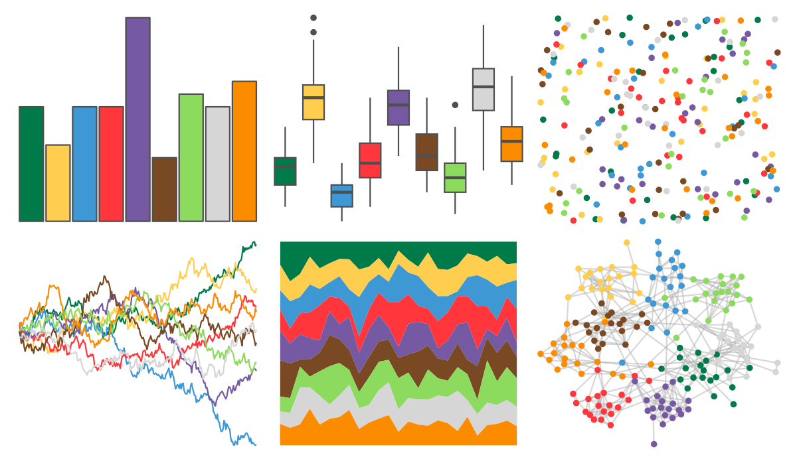

# awtools - mpalette 

::: columns
::: {.column width="50%"}

**Github**

[awhstin/awtools](https://github.com/awhstin/awtools)
:::

::: {.column width="50%"}

**CRAN**

Not on CRAN
:::
:::

<hr> 

Use with [paletteer](https://emilhvitfeldt.github.io/paletteer/) package:

```r
library(paletteer)
paletteer_d("awtools::mpalette")
```

Use raw:

```r
c("#017A4AFF", "#FFCE4EFF", "#3D98D3FF", "#FF363CFF", "#7559A2FF", "#794924FF", "#8CDB5EFF", "#D6D6D6FF", "#FB8C00FF")
``` 

 

<br>

# Related Palettes

<div class="list" style="display: grid; grid-template-columns: auto auto auto;"> <figure class="figure">
<a href="../../awtools/a_palette/"> </a>
</figure> <figure class="figure">
<a href="../../ButterflyColors/hamadryas_feronia/"> </a>
</figure> <figure class="figure">
<a href="../../ButterflyColors/hamadryas_feronia/"> </a>
</figure> <figure class="figure">
<a href="../../ggthemr/flat_dark/"> </a>
</figure> <figure class="figure">
<a href="../../LaCroixColoR/PinaFraise/"> </a>
</figure> <figure class="figure">
<a href="../../feathers/rose_crowned_fruit_dove/"> </a>
</figure> <figure class="figure">
<a href="../../ggthemr/earth/"> </a>
</figure> <figure class="figure">
<a href="../../RColorBrewer/Accent/"> </a>
</figure> <figure class="figure">
<a href="../../tidyquant/tq_light/"> </a>
</figure> <figure class="figure">
<a href="../../yarrr/xmen/"> </a>
</figure> <figure class="figure">
<a href="../../basetheme/brutal/"> </a>
</figure> <figure class="figure">
<a href="../../ggthemes/few_Medium/"> </a>
</figure> 
</div>
