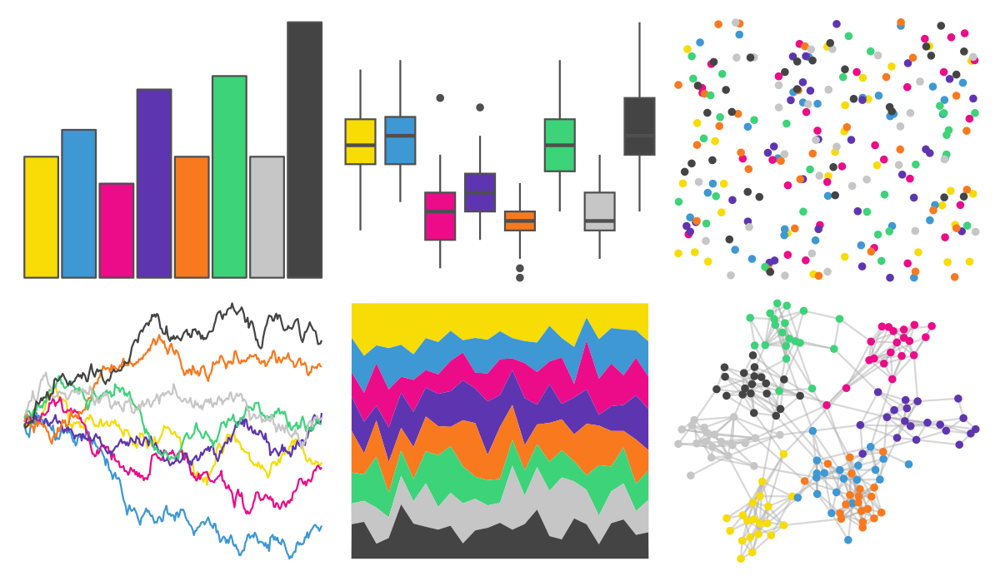

# awtools - ppalette 

::: columns
::: {.column width="50%"}

**Github**

[awhstin/awtools](https://github.com/awhstin/awtools)
:::

::: {.column width="50%"}

**CRAN**

Not on CRAN
:::
:::

<hr> 

Use with [paletteer](https://emilhvitfeldt.github.io/paletteer/) package:

```r
library(paletteer)
paletteer_d("awtools::ppalette")
```

Use raw:

```r
c("#F7DC05FF", "#3D98D3FF", "#EC0B88FF", "#5E35B1FF", "#F9791EFF", "#3DD378FF", "#C6C6C6FF", "#444444FF")
``` 

 

<br>

# Related Palettes

<div class="list" style="display: grid; grid-template-columns: auto auto auto;"> <figure class="figure">
<a href="../../awtools/a_palette/"> </a>
</figure> <figure class="figure">
<a href="../../tidyquant/tq_green/"> </a>
</figure> <figure class="figure">
<a href="../../rcartocolor/Bold/"> </a>
</figure> <figure class="figure">
<a href="../../RColorBrewer/Accent/"> </a>
</figure> <figure class="figure">
<a href="../../peRReo/calle13/"> </a>
</figure> <figure class="figure">
<a href="../../awtools/mpalette/"> </a>
</figure> <figure class="figure">
<a href="../../jcolors/pal6/"> </a>
</figure> <figure class="figure">
<a href="../../unikn/pal_unikn_pref/"> </a>
</figure> <figure class="figure">
<a href="../../RColorBrewer/Set1/"> </a>
</figure> <figure class="figure">
<a href="../../Redmonder/qMSO12/"> </a>
</figure> <figure class="figure">
<a href="../../ggsci/category10_d3/"> </a>
</figure> <figure class="figure">
<a href="../../ggthemes/Classic_10/"> </a>
</figure> 
</div>
